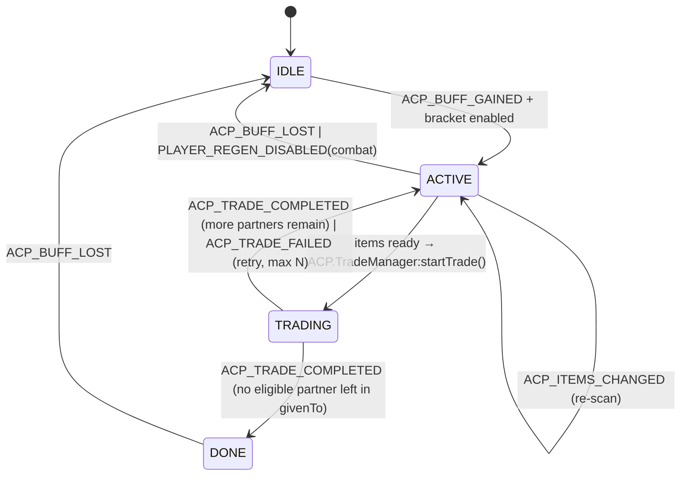

# ArenaChillPrep Architecture

This document describes the architecture of the **ArenaChillPrep** addon (v0.1) — automatic handoff of crafted items to a partner during arena preparation (TBC Anniversary, Interface `20506`).

---

## 1. Principles

1. **Modularity.** Each module is a separate file-table. A module knows nothing about the internals of other modules — only their public API.
2. **One global object.** `ACP` is the addon's only global table. Inside — nested modules: `ACP.Events`, `ACP.ArenaPrep`, `ACP.Inventory`, `ACP.DeliveryController`, `ACP.TradeManager`, `ACP.Settings`, `ACP.Data.*`, `ACP.Utils.*`.
3. **Event-driven.** All inter-module communication goes through events (callback registration in `ACP.Events`). No direct calls, no time-based dependencies.
4. **No libraries.** Vanilla WoW API only. The addon must work without external dependencies (unlike Gargul, which uses Ace — overkill here).
5. **Testability.** Logic (state machine, item catalog, counters) is separated from the game API so unit tests can be written in a sandbox (see `Tests/`).
6. **Gameplay safety.** The addon does nothing destructive: it only opens the trade window and places items. The player confirms the trade manually (no auto-accept — `AcceptTrade()` is restricted on 2.5.x).

---

## 2. Module overview

```mermaid
graph TD
    subgraph Data
        C[Data/Constants.lua]
        I[Data/Items.lua]
        D[Data/DefaultSettings.lua]
        L[Data/Localization.lua]
        WF[Data/Workflows.lua]
        WW[Data/WarlockWorkflows.lua]
        MW[Data/MageWorkflows.lua]
    end

    subgraph Core
        B[bootstrap.lua]
        E[Classes/Events.lua]
        S[Classes/Settings.lua]
        SM[Classes/StateMachine.lua]
        PR[Classes/Preconditions.lua]
        SMIG[Classes/SettingsMigrator.lua]
    end

    subgraph Logic
        AP[Classes/ArenaPrep.lua]
        INV[Classes/Inventory.lua]
        DC[Classes/DeliveryController.lua]
        TM[Classes/TradeManager.lua]
        TP[Classes/TradePlanner.lua]
        WREPO[Classes/WorkflowRepository.lua]
        WKC[Classes/WorkflowKeybindController.lua]
        WSB[Classes/WorkflowSpellbook.lua]
        SCAT[Classes/SpellbookCatalogBuilder.lua]
        SEXT[Classes/WarlockCatalogExtender.lua]
        MEXT[Classes/MageCatalogExtender.lua]
        CDIS[Classes/ClassCatalogDispatch.lua]
        SLBL[Classes/SpellbookLabels.lua]
        WE[Classes/WorkflowEngine.lua]
        WB[Classes/WorkflowBindings.lua]
        WCC[Classes/WorkflowCastController.lua]
        PAC[Classes/PetAbilityCaster.lua]
        WIS[Classes/WorkflowItemSteps.lua]
    end

    subgraph UI
        O[Classes/OptionsUI.lua]
        W[Classes/UI/Widgets.lua]
        WUI[Classes/UI/WorkflowUI.lua]
        WEL[Classes/UI/Welcome.lua]
    end

    B --> E
    B --> S
    B --> AP
    B --> INV
    B --> DC
    B --> TM
    B --> WE
    B --> O
    O --> W
    O --> WUI
    B --> WEL
    WEL --> O

    E --> AP
    E --> INV
    E --> DC
    E --> TM
    E --> WE

    AP -- "buff gained / buff lost" --> DC
    AP -- "buff lost" --> WE
    INV -- "items changed (itemID, count)" --> DC
    DC -- "startTrade(unit) / queueItems(...)" --> TM
    TP -- "categoriesForPartner / buildQueue(unit)" --> DC
    TM -- "trade result (opened/closed/completed)" --> DC
    WE -- "getDefinition/getCatalogEntry" --> WREPO
    WE -- "step executors (engine state)" --> WCC
    WE -- "step executors (engine state)" --> PAC
    WE -- "step executors (engine state)" --> WIS
    WE -- "buttons + key bindings" --> WB
    WSB -- "rebuild orchestration" --> SCAT
    WSB -- "rebuild orchestration" --> CDIS
    CDIS -- "active class" --> SEXT
    CDIS -- "active class" --> MEXT
    SEXT -- "warlock data" --> WW
    MEXT -- "mage data" --> MW
    WF -- "classWorkflows registry" --> WW
    WF -- "classWorkflows registry" --> MW
    WSB -- "labels" --> SLBL
    S -- "migrations" --> SMIG
    WUI -- "CRUD + step factory" --> WREPO
    WUI -- "key I/O" --> WKC

    DC --> PR
    WE --> PR
    DC --> SM
    WE --> SM
    S --> DC
    S --> TM
    O --> S
    O --> DC
    WUI --> WSB
    WSB -- "ACP_SPELLBOOK_CHANGED" --> WUI
    S -- "ACP_SETTINGS_RESET" --> O
```



### 2.1 `bootstrap.lua` — entry point

- Creates the global `ACP` table.
- Creates an invisible event frame `ACP.Frame` (`CreateFrame("Frame")`).
- Subscribes to `ADDON_LOADED` and initializes modules in strict order:
  1. `ACP.Data.*` (already loaded via TOC)
  2. `ACP.Events:_init(frame)`
  3. `ACP.Settings:_init()` — reads `ArenaChillPrepDB`
  4. `ACP.WorkflowSpellbook:_init()` — runtime spellbook scan
  5. `ACP.ArenaPrep:_init()`
  6. `ACP.Inventory:_init()`
  7. `ACP.TradeManager:_init()`
  8. `ACP.WorkflowEngine:_init()` — secure cast buttons + bindings
   9. `ACP.DeliveryController:_init()`
   10. `ACP.WorkflowBindings:_init()`
   11. `ACP.OptionsUI:_init()`
   12. `ACP.Welcome:_init()` — first-run welcome popup (Warlock-only)
- `WorkflowRepository`, `TradePlanner`, `StateMachine` and `Preconditions` are **init-free** (pure helpers/mixins — no event subscriptions, no state).
- Right after initialization it runs an initial state check (`ArenaPrep:checkNow()`), to catch the case where the buff is already active when the addon loads (e.g., after `/reload` in an arena).

### 2.2 `Classes/Events.lua` — event bus

A simplified version of the Gargul pattern:

```lua
ACP.Events:register(identifier, event, callback)
ACP.Events:unregister(identifier, event)
ACP.Events:fire(event, ...)
```

- The frame's `OnEvent` dispatches raw game events to subscribers.
- `fire` is used by modules for internal events (`ACP_BUFF_GAINED`, `ACP_ITEMS_CHANGED`, `ACP_TRADE_*`).
- Lets modules unsubscribe without knowing about other subscribers.

### 2.3 `Classes/ArenaPrep.lua` — arena preparation detection

Answers one question only: **is the preparation buff active right now?** Plus, as a side responsibility: **which arena bracket are we in?**

```lua
ACP.ArenaPrep:isActive() -> boolean
ACP.ArenaPrep:checkNow()  -- forced re-check
ACP.ArenaPrep:getBracket() -> "2v2" | "3v3" | "5v5" | nil
ACP.ArenaPrep:getRemainingTime() -> number | nil  -- seconds until the prep buff expires (gate open)
ACP.ArenaPrep:getPartySize() -> number  -- party members (0 when solo/unavailable); shared by bracket, partner and status
```

- Looks up the buff by spellID `32727` — **verified on 2.5.5**: `C_UnitAuras.GetPlayerAuraBySpellID(32727)` returns an object. (`UnitBuff("player", name)` crashes — the deprecated wrapper only accepts a numeric index; `UnitAura(unit, i, filter)` returns shifted legacy positions with no spellID/expirationTime — neither is usable here.)
- **Remaining time = gate-open countdown.** Verified on 2.5.5: the prep buff aura reports `duration=0`/`expirationTime=0`, so the aura cannot measure the countdown. The working source (ArenaAnalytics + sArena on the same client) is `CHAT_MSG_BG_SYSTEM_NEUTRAL` + the localized countdown message map (`ACP.Data.Constants.ARENA_COUNTDOWN_MESSAGES`): "One minute..." = 60, "Thirty seconds..." = 30, "Fifteen seconds..." = 15, "The Arena battle has begun!" = 0. `countdownEndTime = GetTime() + N` (seeded `+60 s` on buff gain as a fallback); `getRemainingTime()` = `countdownEndTime - GetTime()`, returns `nil` if unknown (the gate check then does not block).
- **Why not `GetBattlefieldTimeRemaining()`:** it is a battleground match timer, not the pre-gate countdown.
- Listens to `UNIT_AURA` (filter `"player"`) and `PLAYER_ENTERING_WORLD`.
- On state change: `Events:fire("ACP_BUFF_GAINED")` / `Events:fire("ACP_BUFF_LOST")`.
- **Extra safety:** a periodic ticker (1 s) while the buff is active, because `UNIT_AURA` in TBC doesn't always fire when the buff fades — a known quirk.

**Bracket detection** (researched & verified available on 20506):

```lua
-- Primary signal: party size. In TBC you queue with a group of exactly the
-- bracket size; the group is locked once inside the arena, so it's stable.
local partySize = GetNumPartyMembers() + 1;  -- 2, 3 or 5
local bracketBySize = { [2] = "2v2", [3] = "3v3", [5] = "5v5" };
local bracket = bracketBySize[partySize];

-- Cross-check: GetNumArenaOpponents() was added in 2.5.1 (present on 20506).
-- Returns 1/2/4; may be 0 briefly at arena load → party size remains the
-- source of truth, the opponent count is only a sanity check.
if (bracket and GetNumArenaOpponents) then
    local opponents = GetNumArenaOpponents();
    if (opponents and opponents > 0) then
        -- optional: log a mismatch; don't override party size
    end
end
return bracket;  -- nil if not in a recognized bracket
```

Notes:
- **`GetNumPartyMembers` is the TBC-era name.** `GetNumSubgroupMembers` only exists from 5.0.4+; shim both (`GetNumPartyMembers or GetNumSubgroupMembers`).
- Unknown sizes (e.g. `4`) → `nil` → the bracket is treated as not enabled (see 2.5).
- Only call it while `isInArena` (instance type `arena`) — outside an arena the party size has nothing to do with brackets.

### 2.4 `Classes/Inventory.lua` — bag scanner

```lua
ACP.Inventory:getCount(itemID) -> number
ACP.Inventory:findItem(itemID, skipSoulbound) -> bagID, slot, count | nil
```

- `findItem` delegates to `Utils/Items.findItemInBags` — a simplified port of Gargul's `GL:findBagIdAndSlotForItem`; with `skipSoulbound = true` (default) items with no trade time remaining are skipped, so only tradable items are ever placed.

- Full bag scan (bag `0..4`, slots `1..GetContainerNumSlots(bag)`).
- Counts with stacks (`GetContainerItemInfo(bag, slot)` → `stackCount`).
- Listens to `BAG_UPDATE` / `BAG_UPDATE_DELAYED`.
- When the count of any tracked item changes — `Events:fire("ACP_ITEMS_CHANGED", itemID, count)`.
- Cache: after `BAG_UPDATE` only the affected bag is re-counted (optimization); a full scan invalidates everything.
- The set of tracked itemIDs comes from `ACP.Data.Items.classItems[englishClass]` + settings (which ranks are enabled) — `classItems` maps `WARLOCK → {healthstones}` and `MAGE → {food, water}`. `UnitClass` is read at CALL time (the class is unknown at ADDON_LOADED; `_buildTrackedItems` re-runs on PLAYER_LOGIN).

### 2.5 `Classes/DeliveryController.lua` — orchestrator (core logic)

The only module that makes **decisions**. States:



On `ACP_BUFF_GAINED` the controller first checks the bracket gate:

```
local bracket = ACP.ArenaPrep:getBracket();          -- "2v2" | "3v3" | "5v5" | nil
if (not bracket or not Settings:get("brackets." .. bracket)) then
    -- log: "bracket <bracket or 'unknown'> not enabled, skipping" → stay IDLE
    return;
end
state = ACTIVE
```

`ACTIVE` state logic (on each `ACP_ITEMS_CHANGED` event or ticker):

```
partner = findPartner()          -- first eligible party member (not in givenTo)
categories = TradePlanner:categoriesForPartner(partner)
                                  -- a Mage gives water only to mana-using partner classes
for each category in categories:
    for each selected rank (paired IDs count as ONE rank):
        count = sum of ACP.Inventory:getCount(itemID)
        if count < setting.count: not ready
if ready and not in combat
        and (ACP.ArenaPrep:getRemainingTime() or math.huge) >= Settings:get("gateSafetySeconds"):
    ACP.TradeManager:startTrade(partner)
```

**Per-partner readiness (v0.3, 2026-08-26).** The partner is determined BEFORE the
readiness check, and `itemsReady(partner)` only requires the categories the partner
should receive (`TradePlanner:categoriesForPartner`): a Mage requires BOTH food AND
water for a mana-using partner (Priest/Paladin/Warlock/Druid/Hunter/Shaman — table
`Data.Items.magePartnerCategories`), but only food for a Rogue/Warrior partner (water
stays in the bags and never blocks the trade). Unlisted partner classes (unknown at
call time) receive everything. Warlock autotrade is untouched — the table only filters
the MAGE's categories; a Warlock's healthstones go to every partner.

- **Partner detection** (`partnerMode`):
  - `"auto"` (default): the first party member that isn't `"player"`, is within trade range (`UnitExists`, `UnitIsUnit`) and is **not in `givenTo`**. All party members are friendly in an arena.
  - `"party1"`: fixed slot from the `manualPartner` setting.
- **Bracket gate:** only `ACTIVE` (and therefore trading) if the current bracket from `ArenaPrep:getBracket()` is enabled in `Settings:get("brackets." .. bracket)` — default **2v2 only**.
- **Per-partner trade protection (`givenTo`):** runtime-only set (per prep, **not** saved to `ArenaChillPrepDB`) of partners who already received items, reset on `ACP_BUFF_LOST`. Partner detection skips `givenTo` members; after `ACP_TRADE_COMPLETED` the partner is added. When no eligible partner remains → `DONE`; otherwise the controller returns to `ACTIVE` to await the next crafted item. (2v2 = one partner → effectively one trade per prep.)
- **Gate safety:** a trade is only initiated while `ArenaPrep:getRemainingTime() >= Settings:get("gateSafetySeconds")` (default 15); pending initiations/retries are cancelled once the remaining time drops below the threshold. An already-open trade window is left untouched.
- **Reset:** `ACP_BUFF_LOST` or entering combat → `IDLE` (the combat flag clears on `PLAYER_REGEN_ENABLED`).
- **Shared preconditions (refactor Phases 3-4, 2026-08-24):** `canStartTrade` delegates the shared gates (enabled / in-arena / not-in-combat / not-dead / gate safety) to `ACP.Preconditions`; the WHAT-to-pass grouping lives in `ACP.TradePlanner` — `DeliveryController:categoryReady`/`itemsReady` delegate to it, and on `ACP_TRADE_OPENED` the controller fills the TradeManager queue with `TradePlanner:buildQueue(unit)` (the partner is normalized name → `partyN` token first, so the per-partner class filters can read `UnitClass`). State writes go through the `ACP.StateMachine` mixin (`setState` with enum validation — `Data.Constants.DELIVERY_STATE`).

### 2.6 `Classes/TradeManager.lua` — trade automation

A low-level module. Knows only about one trade window. It is a dependency-free port of the patterns proven in Gargul's `Classes/TradeWindow.lua` (same client).

```lua
ACP.TradeManager:startTrade(unit)     -- InitiateTrade; outcome via ACP_TRADE_COMPLETED / ACP_TRADE_FAILED
ACP.TradeManager:queueItems(itemIDs)  -- replace the FIFO queue (WHAT to pass is decided by TradePlanner)
ACP.TradeManager:cancel()             -- cancel/reset the current attempt
ACP.TradeManager:getPartner() -> string|nil  -- unit token of the trade in progress
```

- **Restored low-level contract (refactor Phase 3, 2026-08-24):** the `queueConfiguredItems` decision logic (Settings/Data/Inventory reads) lived here against the "dependency-free" contract — it now lives in `Classes/TradePlanner.lua`. TradeManager only places whatever the orchestrator queues: on `TRADE_SHOW` it fires `ACP_TRADE_OPENED`, and the `DeliveryController` fills the queue via `TradePlanner:buildQueue(unit)` before the FIFO ticker starts. **Queue entries are per BAG STACK (v0.3):** the client moves a WHOLE stack per `UseContainerItem` (the observed live behavior: 20 conjured food landed as 2×10 whole stacks while the water never followed), so `buildQueue` enqueues one entry per stack slot (`Utils/Items:findItemSlots`), limited to the stacks needed to reach `count`. The old per-ITEM queue (20 entries per category) wasted ~18 no-op ticks per category after the first stack — the food landed in 0.3 s, water sat in the bags for 3+ s while the player accepted the food-only trade — and depended on the mid-trade queue rebuild to shrink.

WoW events: `TRADE_SHOW`, `TRADE_CLOSED`, `TRADE_ACCEPT_UPDATE`, `TRADE_TARGET_ITEM_CHANGED`, `ITEM_UNLOCKED`, `UI_INFO_MESSAGE`.

Flow (adapted from Gargul):

```
InitiateTrade(unit)
    └─> one-shot listener on TRADE_SHOW + 1 s timeout
         ├─ timeout → callback(false) → ACP_TRADE_FAILED("timeout")
         └─ TRADE_SHOW → verify partner
              (UnitName("NPC", true) + TradeFrameRecipientNameText, handles Name-Realm)
              → callback(true)
              → process the FIFO queue on a short repeating ticker (one item per tick):
                    find the item in bags, skip soulbound (Inventory:findItem)
                    UseContainerItem(bag, slot)  -- game auto-places it into the next free slot
              → ITEM_UNLOCKED: if the game removed an item added < 0.5 s ago → re-queue it
              → if autoAccept:
                    C_Timer.After(tradeDelay, TradeFrameTradeButton:Click())
              → completion: UI_INFO_MESSAGE == ERR_TRADE_COMPLETE
                    → Events:fire("ACP_TRADE_COMPLETED")
                    → TRADE_CLOSED without completion → Events:fire("ACP_TRADE_FAILED", reason)
```

- **Why `UseContainerItem` instead of `PickupContainerItem` + `ClickTradeButton`:** with the trade window open, `UseContainerItem(bag, slot)` places the item into the next available trade slot automatically — one call instead of two, and it's what Gargul uses on the same client.
- **One item per tick.** Adding items too fast makes the game silently remove them from the trade window. The FIFO queue + repeating ticker prevents this; the `ITEM_UNLOCKED` re-add covers the rare cases where it still happens.
- **Completion detection.** `TRADE_CLOSED` fires before the completion message, so it must not be treated as success. Success is detected via `UI_INFO_MESSAGE` with `ERR_TRADE_COMPLETE` (as Gargul does; verify on TBC Anniversary).
- **Retries:** on `ACP_TRADE_FAILED` — up to 3 attempts with backoff (2 s, 4 s, 8 s), then a silent give-up until the next event.
- **Safety:** never touches gold; only slots `TRADE_PLAYER_ITEM_1..6`.
- **Errors** (`ACP_TRADE_FAILED` with reason): timeout (window didn't open), out of range, in combat, partner declined, window closed before placement, item ran out (another source).
- **Cursor hygiene:** always `ClearCursor()` on `TRADE_CLOSED` in case an item is still on the cursor.
- **Timers:** use `ACP.Utils.Timers` (named wrappers over `C_Timer.After` / `C_Timer.NewTicker` — available on 20506), not Ace.

### 2.7 `Classes/Settings.lua` (+ `Classes/SettingsMigrator.lua`) and `Data/DefaultSettings.lua`

- `ArenaChillPrepDB` — SavedVariables (see `.ai/CONTEXT.md`).
- `Settings:get(path)` / `Settings:set(path, value)` — access by dot path (`"items.soulstone.count"`).
- `Settings:reset()` — restores a **deep copy** of `ACP.Data.DefaultSettings` (via `Utils/Tables:deepCopy`, so the live Data never shares nested tables with the defaults) and re-syncs the panel via the `ACP_SETTINGS_RESET` event (OptionsUI subscribes; no reverse data → UI call — refactor Phase 2, 2026-08-24). Used by the "Reset to defaults" button in the General subcategory.
- On load — deep merge of defaults and saved data (robust against new settings added in future versions). The **workflows branch merges per-slot REPLACE, not deepMerge**: a saved `definitions[N]` fully wins over the default one. (deepMerge would index-merge the steps ARRAYS and produce hybrids of old + new default steps.) `ensureDefaults` is array-aware for the same reason — missing step indices are never filled from defaults. Placeholder definitions from the previous defaults (exact name + steps match) are replaced by the Warlock class defaults before the merge (`migratePlaceholderDefinitions`); user-edited definitions are never touched.
- **Class-gated default definitions (v0.2):** `DefaultSettings.workflows.definitions` is EMPTY. `SettingsMigrator:applyClassDefaults(workflows, englishClass)` fills slots 1..5 (deep-copied) from the active class's `defaultDefinitions` (`Data/WarlockWorkflows.lua` / `Data/MageWorkflows.lua`) when definitions are empty — run in `Settings:_init()` (skipped when `UnitClass("player")` is nil at ADDON_LOADED) and re-run on PLAYER_LOGIN. `Settings:reset()` re-applies them. Per-character SavedVariables guarantee a Mage never receives Warlock definitions.
- **`itemsReady` requires all enabled categories of the PARTNER (v0.2 → v0.3):** a Mage trades only when the count targets of every category the PARTNER should receive are met (`categoryReady` per category; the settings key maps through `Data.Items:settingsKeyFor(category)` — the old `category:sub(1, -2)` strip broke for "food"/"water"). `itemsReady(partnerUnit)` delegates the per-partner category selection to `TradePlanner:categoriesForPartner(partnerUnit)` — food AND water for mana-using partner classes, food only for Rogue/Warrior; without a partner unit it means "every enabled category" (a Warlock has one category, so its behavior is unchanged either way).
- **Refactor Phase 7:** the whole migration/normalization pipeline lives in `Classes/SettingsMigrator.lua` (`migrateWorkflowNames`, `migrateStepSpellIDs`, `migratePlaceholderDefinitions`, `applyClassDefaults`, `normalizeRankKeys`, `ensureDefaults`) — Settings keeps only the dot-path store, `persist` and the `_init` orchestration.

### 2.8 `Classes/OptionsUI.lua` (+ `Classes/UI/Widgets.lua`, `Classes/UI/WorkflowUI.lua`, `Classes/WorkflowSpellbook.lua`)

The settings UI is split into **presentation** (`Classes/UI/Widgets.lua`, `Classes/UI/WorkflowUI.lua`) and **logic** (`Classes/OptionsUI.lua`), inspired structurally by Prat-3.0 (tabbed subcategories, header dividers, tooltips on every control, reset button). See `.ai/docs/ui-redesign-plan.md` for the full spec.

**`Classes/UI/Widgets.lua`** — reusable vanilla-API widgets in `ACP.UI.*`, with all geometry constants in one place:

```lua
ACP.UI.PANEL_WIDTH  = 660   ACP.UI.PANEL_HEIGHT = 400
ACP.UI.PADDING      = 14    ACP.UI.ROW_HEIGHT   = 24
ACP.UI.GAP          = 16    ACP.UI.BOX_INSET    = 10
ACP.UI.DISABLED_ALPHA = 0.4
ACP.UI.Box(parent, x, y, w, h)                    -- boxed container (BackdropTemplate)
ACP.UI.Header(parent, text, x, y)                 -- yellow section header
ACP.UI.Divider(parent, x, y, w)                   -- horizontal divider between groups
ACP.UI.Checkbox(parent, name, text, x, y, getter, setter, tooltipText)
ACP.UI.Slider(parent, name, text, x, y, min, max, step, getter, setter, tooltipText)
ACP.UI.Button(parent, text, x, y, w, h, onClick, tooltipText)
ACP.UI.Dropdown(parent, name, text, x, y, width, items, getter, setter, tooltipText)
ACP.UI.TextInput(parent, name, x, y, w, h, getter, setter, tooltipText)
ACP.UI.ScrollFrame(parent, x, y, w, h)            -- returns sf with .ScrollChild + .Refresh
```

- Widgets are **presentation-only**: they know nothing about `ACP.Settings` — callers pass `getter`/`setter` closures (kept from the old code). Tooltips are passed as text and attached via `GameTooltip` `OnEnter`/`OnLeave` (`ANCHOR_RIGHT`, `wrap=true`) to the widget AND its label.
- Client gotchas honored: `CreateFrame(..., "BackdropTemplate")` is mandatory before `SetBackdrop`; `OptionsSliderTemplate` does NOT create a global `"<name>Text"` (the label is built manually with `CreateFontString` above the slider); no Ace — all controls are Blizzard templates (`UICheckButtonTemplate`, `OptionsSliderTemplate`, `UIPanelButtonTemplate`, `UIDropDownMenuTemplate`, `InputBoxTemplate`, `UIPanelScrollFrameTemplate`).
- `UI.Dropdown` requires a **unique global name** per instance: `UIDropDownMenuTemplate` names its children `<name>Text`/`<name>Button`/`<name>Left`/..., so anonymous frames would collide on those globals. Same for `UI.TextInput` (`InputBoxTemplate` → `<name>Left`/`<name>Middle`/`<name>Right`). `UI.ScrollFrame` auto-uniquifies its name (embedded `<name>ScrollBar`). Dropdown items are `{value, label, isTitle?}` arrays or builder functions re-evaluated on every menu open; selection is driven by `getter()` (value-based checkmark + collapsed label via `UIDropDownMenu_SetSelectedValue`), the setter writes the new value, and `.Refresh` re-runs the initializer.

**`Classes/WorkflowSpellbook.lua`** — runtime spell catalog for the Workflow editor (`ACP.WorkflowSpellbook`), a **facade** (refactor Phase 7) over `SpellbookCatalogBuilder` (catalog assembly, rank metadata, reads), the per-class extenders (`WarlockCatalogExtender` / `MageCatalogExtender`, both behind `ClassCatalogDispatch` — the ACTIVE class's static fallback + extras) and `SpellbookLabels` (`stoneStepLabel`). The catalog is rebuilt from the STATIC data only (the live spellbook scan was removed — see ADR 17): a Warlock gets the full Warlock static catalog, a Mage the full Mage catalog (v0.2), other classes an empty one:

- The catalog is assembled from the ACTIVE class's static data (`ACP.Data.classWorkflows(englishClass).spells` + its rank table via `Data/Workflows:rankedCreates(data)` = `conjuredRanks or stoneRanks`) with the class gate in `ClassCatalogDispatch` (no-op for unknown classes). Known workflow metadata (summon/create-item/buff/target/reagent behavior) enriches the entries, and the pet abilities + the full stone-rank list are merged in for a confirmed Warlock; the conjured ranks (Conjure Food 33717→22019, Conjure Water 27090→22018) are merged for a confirmed Mage. `WorkflowSpellbook:scan()` calls `ClassCatalogDispatch:merge()` + `ClassCatalogDispatch:addStaticFallback()`; the old facade delegates (`mergeStaticWarlock`/`addStaticFallback`) route through the dispatcher so callers/tests keep compiling. **Module rule (v0.2):** read `UnitClass` at CALL time — never capture it at file scope (the class is unknown at ADDON_LOADED and tests override the stub; `TradePlanner` previously captured it and blocked the per-class mapping).
- **Mage catalog (v0.2):** 13 buffs (Arcane Brilliance 27127, Arcane Intellect 27126, Amplify Magic 1008+33946 as TWO separate same-name entries with `rank` 1/6, Dampen Magic 604+33944 likewise, Mage Armor 27125, Molten Armor 30482, Ice Armor 27124, Fire Ward 27128, Frost Ward 32796, Ice Barrier 33405, Invisibility 66 — all user-verified 2026-08-25) + createItem (Conjure Food 33717→Conjured Croissant 22019, Conjure Water 27090→Conjured Glacier Water 22018 — **verified: rank-8 food creates the CROISSANT, not the Manna Biscuit 34062 which comes from the Ritual of Refreshment table**) + utility (Ritual of Refreshment 43987 — Summon Object, no bag item). No summons/pets/equipItems for a Mage (the equip-items Add-Step category stays Warlock-only). **Ranked-buff menu listing:** a group whose entries ALL carry a rank (Amplify/Dampen) is listed per rank in Add Step (`SpellbookLabels:rankStepLabel`) so rank 1 is selectable — a plain group entry would only ever add the max rank; `SpellbookCatalogBuilder:addEntry` takes the rank from `staticMetadata` (matched by exact spellID FIRST — a name-match returns the first same-name entry's metadata for all of them).
- **Soul Link catalog fix (2026-08-22):** the catalog previously shipped `6307` as Soul Link — but 6307 is the Imp's **Blood Pact** passive (verified via WeakAurasTemplates TBC data). The correct Soul Link talent spell is **19028** (its applied aura is 25228, also named "Soul Link" — skip-if-buffed matches by NAME). The old entry made the UI show "Blood Pact" and the skip check matched the imp's always-on aura, so Soul Link was never cast. `Settings:migrateStepSpellIDs` rewrites saved cast steps `6307 → 19028` on load.
- **Ranked-buff catalog = max rank only (2026-08-25):** Demon Armor ships as its TBC max rank **27260** (user-verified in-game) — the old rank-1 706 was replaced in the spellbook at 70 and never cast. A saved 706 step is migrated to 27260 (same `migrateStepSpellIDs` pipeline as Soul Link). **Create Soulstone (693) and Ritual of Summoning (698) were REMOVED** from the catalog (user decision — no arena use / no such spell on this client); saved steps with either are skipped as unknown at runtime (they resolve to no known family rank).
- **createItem item-variant expansion (2026-08-22):** healthstone ranks 1-5 exist as historical item-ID pairs (`19012/19013` etc.); the client conjures ONE variant per rank (rank 5 → `19013`, live-verified — a cast stored as `11730/19012` still creates `19013`). The rank tables' `itemIDs` list the variants; the engine's expected-item set, goal-met skip and the unlearned-rank fallback all expand to the full variant set — a step completes only on its OWN rank (never another rank's stone), but on either variant of that rank. Mage conjured items have a SINGLE itemID per rank (`conjuredRanks[27090].itemIDs = { 22018 }`).
- **Conjure-step count-target goal-met (v0.2):** `WorkflowItemSteps:isItemAlreadyPresent` checks the active class's rank table; when the entry's `category` maps (via `Items:settingsKeyFor`) to an ENABLED `items.<key>` setting with a `count`, the goal is `totalCount >= setting.count` (the autotrade trigger threshold — two identical Conjure Water steps conjure 10+10 while the skip fires only at 20; Mage defaults ship 2× Conjure Water + 2× Conjure Food). Otherwise the old "any variant present" behavior holds. Warlock stones map to `items.healthstone.count = 1` — "≥ 1 present" is identical to the old check (no Warlock change); spellstones have no items setting → unchanged delta path. Completion (`isItemCreated`) stays DELTA-based — a cast that adds a stack advances the step.
- **Pet-ability steps armed during a player cast:** a pet step that directly follows a cast-time step is armed (macro baked on the secure button) so its key can be pressed DURING the cast — but ONLY when the pet EXISTS (`UnitExists("pet")` gate, 2026-08-22: arming during a SUMMON made a mid-cast press execute the pet macro with no pet to route it to, interrupting the summon and popping "blocked action"; without the pet the buttons are made inert and the step runs standalone after the summon completes). Pet macros bake BOTH conditionals — `/cast [pet:<type>,@unit] <ability>`: `[@unit]` targets, `[pet:<type>]` makes the macro a no-op when that pet is not out. **Verification (2026-08-22):** the client silently swallows a pet ability pressed EARLY in the player's cast (Sacrifice at +2s of a 6s summon did nothing; +5s fired, live-verified). The engine must NOT mark the step done on the press itself — `isPetAbilityApplied(step)` verifies the effect (buff present on target by NAME, or the Voidwalker consumed during the cast); if unverified, `armPetVerify` polls every 0.1s and the step stays armed — the user's spam eventually lands the ability. `petStepDone` survives `advance()` (the cast-completion transition) so a confirmed armed press skips the pet step; `pause()`/`reset()`/cast-interrupt/`cancelTimers` all clear the poll.
- **One press = start + cast (2026-08-22):** each slot's Key Bindings UI key is pointed at a per-slot hidden secure button (`ACPWorkflowButton<N>`) via `SetOverrideBindingClick(owner, true, key, button)` — a PRIORITY OVERRIDE (BetterFishing pattern, verified on 20506). The player's command binding is NEVER displaced: `GetBindingKey` keeps returning the real binding, so the Blizzard Key Bindings UI and the Workflows-tab key capture work normally (the transient `SetBindingClick` takeover broke key assignment entirely and was removed). The button's **PreClick** starts/resumes the slot and arms the step; the SAME press's click casts it (ItemRack pattern). `applySlotBindings` is a full resync (clear overrides → re-apply from the authoritative binding table — safe because the table itself is never modified) on PLAYER_LOGIN / UPDATE_BINDINGS / PLAYER_REGEN_ENABLED / late-binding retry; overrides are dropped while the Blizzard Key Bindings UI is shown (OnShow/OnHide hooks) so its capture dialog gets the presses; they die with the session (nothing to restore/persist on logout). The /acp bind hotkey keeps its own cast-only button.
- **gateSafety only blocks cast-time steps (2026-08-22):** instant spells, pet abilities and equipItem steps are exempt — they complete in <1 GCD and cannot be caught mid-cast when the gates open. A gateSafety pause on an instant step created a resume→pause infinite loop in the arena's last seconds.
- **One run per prep/test (2026-08-22):** after DONE the workflow key is a NO-OP in both modes — the engine never auto-restarts (the user's "second round" complaint). A fresh run starts on `ACP_BUFF_LOST` (new arena) or by re-issuing `/acp workflowtest N`, which calls `reset()` before `start()`. All workflow chat messages are debug-only (`ACP:debugPrint`); slash-command responses stay `ACP:print`.
- **Step targeting (2026-08-22):** party-targeted steps cast DIRECTLY at the unit, never via the player's current target: player spells set the secure button's `unit` attribute (`requestKeyCast`, M6 ActionBook pattern), pet abilities bake `[@unit]` macro conditionals (`petMacroText` — the legacy `[target=unit]` form does not redirect pet casts on this client), and `checkGates` pauses with `reasonNoTarget` when a non-player target's `UnitExists` is false (solo test/raid group/member left — never silently buff the wrong unit). `clearKeyCast`/`equipItem`/`petAbility` reset `unit` to nil so a stale party unit cannot retarget a later step. The old `TargetUnit("party1")`/`TargetLastTarget()` swap is REMOVED — calling TargetUnit from insecure code popped "blocked action" on the first party-targeted cast, and the swap was redundant with the unit attribute. The engine never changes the player's current target.
- Rebuilds on `PLAYER_LOGIN` (the initial ADDON_LOADED rebuild runs before the character class is known) and on `SPELLS_CHANGED`; the catalog is runtime-only and never persisted. After a rebuild the spellbook fires `ACP_SPELLBOOK_CHANGED` — the Workflows editor (when built) refreshes its Add Step list via that event (no reverse UI call — refactor Phase 2, 2026-08-24). Steps always store the highest learned rank's exact `spellID` — rank is not user-selectable (the per-step rank dropdown was removed 2026-08-20; it never worked). The stone rank→item maps (`HEALTHSTONE_RESULTS`/`SOULSTONE_RESULTS`) are derived from `Data/Items.lua` (single source — refactor Phase 1).

**`Classes/UI/WorkflowUI.lua`** — the "Workflows" subcategory content (`ACP.WorkflowUI`), **pure layout/render** (refactor Phase 6): data CRUD + the step factory live in `ACP.WorkflowRepository` (`addWorkflow`/`deleteWorkflow`/`cloneWorkflow`/`addStep`/`replaceStep`/`removeStep`/`moveStep`/`buildStep`/`findSpell`; `addStep` and `replaceStep` share `resolveNewStep`), key-binding I/O lives in `ACP.WorkflowKeybindController` (`getSlotKey`/`setSlotKey`/`shiftBindingsAfterDelete`), and control getter/setter pairs come from a `bindPath(path)` helper. A module with dynamic `SelectedSlot`, `build(content, w, h)`, `refresh()`, `setEnabled(flag)`, and a status line:

- Layout (top→bottom, built with a **vertical cursor** — every section builder returns its own height, so the tab adapts to the actual panel size, no magic offsets):
  1. **status line** — engine state + `Slot N: on/off` + step count; the bound key is NOT repeated here (the editable Key control below is the single authoritative presentation). When the global engine is OFF it explains why and shows an "Enable workflow engine" CTA button instead of graying out.
   2. **Workflow defaults** — section header + `skipIfBuffedDefault` checkbox + a short description; kept separate from the per-workflow identity/binding form. The setting is the **master switch** for skipping already-completed steps (see §"Skip already-completed steps" below). The per-step "Skip if done" flag was REMOVED (2026-08-25, user decision) — the setting alone governs skipping; there is no per-step override.
  3. **Workflow editor** — section header + three aligned rows: `Workflow:` dropdown + `+ Add` / `Clone` / `Delete` buttons (labeled, not bare glyphs; their widths are measured from the localized labels so all three fit one row in both locales) / `Name:` input + `Enabled` checkbox / `Key:` keybind capture + `Clear` button (disabled while unbound). The key appears in exactly this one editable place. **Clone (2026-08-24):** copies the SELECTED workflow into a new slot at the end (`WorkflowRepository:cloneWorkflow` — name + steps deep-copied via `Utils/Tables:deepCopy`, `enabled` kept, the name gets a localized ` (copy)` suffix, the key binding is NOT copied) and selects it; at the slot limit it prints the same `slotLimit` message as `+ Add`.
  4. **Steps** — `Steps` header with `+ Add step` dropdown at the right; a subdued table header row (`# / Spell / Target / Actions`); a boxed scrollable list that **fills all remaining panel height** (`updateStepScroll()` recomputes `listH` from the stored content height + `stepListY` on every refresh).
- Step row (40 px tall, single line — the `SpellID:`/`ItemID:` metadata line and the "pet ability" hint were REMOVED as redundant, 2026-08-24): the spell cell dropdown — the COLLAPSED label shows the current spell name and selecting an entry from the same catalog as "+ Add step" REPLACES the step in place (`WorkflowRepository:replaceStep` — the row keeps its position; the new step is rebuilt by the `buildStep` factory, so its type/target come from the defaults of the NEW spell); the dropdown width is computed from the LONGEST possible collapsed label (spell name, per-rank stone label, `"<name> (<pet>)"` pet label, equip-item name — measured in the dropdown's own font, `GameFontHighlightSmallLeft`) plus fixed chrome, so the control never spills into the Target column (the width cache resets on `ACP_SPELLBOOK_CHANGED`). The Target column is fixed width and left-aligned for every row; when a parameter does not apply the row renders an explicit disabled `Not available` value with an explanatory tooltip instead of `Self`/`—` (no pseudo-editable control). The "Skip if done" column was REMOVED (2026-08-25 — the skip decision is the global `workflows.skipIfBuffedDefault` setting only, no per-step flag). Actions are right-aligned `↑`/`↓`/`Delete` buttons with tooltips, Up/Down disabled at the list ends, Delete turns red on hover. Subtle alternating row strip. Rows are rebuilt on every change; retired rows are hidden and moved to a hidden recycle parent (never `SetParent(nil)`, which promotes them to visible top-level frames on 2.5.5); more rows than the box fits → the scrollbar appears; the scroll position is preserved across refreshes (captured before the rebuild, restored + clamped after — W17 fix); after adding a step the list scrolls to the bottom. Stone-creating steps show the rank-specific stone name — `stepSpellLabel()` falls back to `WorkflowSpellbook:stoneStepLabel()`, e.g. `Create Master Healthstone`, because `GetSpellInfo` returns the plain `Create Healthstone` for every rank — so only the spellID would otherwise disambiguate.
- `equipItem` rows (2026-08-20): the ITEM name (`GetItemInfo`/`itemName` fallback) is the cell label; rank/target all render `Not available` — an equip step has no spell, rank or target. No rank dropdown.
   - Add Step menu (2026-08-20): one plain spell-name entry per learned spell (`group.name` only — no rank/SpellID decoration) grouped by category, plus a **Pet abilities** category (Warlock-only — Fire Shield and Sacrifice) whose entries add `pet` steps, plus an **Equip items** category (from `ACP.Data.Workflows.equipItems` — the spellstone family; Warlock-only) whose entries add `equipItem` steps (`"item:<id>"` value convention). Stone-creating spells are listed per rank with the stone's name (`Create Master Healthstone`, `Create Major Healthstone`, …) so the player can pick a specific rank; **Create Spellstone ships ONLY rank 4 (`Create Master Spellstone`, 28172/22646 — ranks 1-3 removed 2026-08-25, user decision)**. The whole list is built from `WorkflowSpellbook`'s scan of the ACTIVE character's spellbook plus the Warlock-only extras — it is never hardcoded to a class. The Imp's Fire Shield (TBC spell 27269, NOT 19483 which resolves to "Immolation" on 2.5.5) is party-castable and gets a Target dropdown like a `cast` buff.
    - Add-step defaults: highest learned rank for the selected spell name (rank is fixed to the max — the old per-row rank dropdown was removed), `target = "player"` (also for party-castable pet steps), `itemID` copied from metadata when available. No per-step skip flag is stored (removed 2026-08-25 — skipping is governed by the global setting). A selected per-rank entry stores that rank's exact `spellID` + `itemID` (e.g. Create Major Healthstone → 11730/19012). Every edit writes through `Settings:set` and persists to the active character profile.
    - **Skip already-completed steps** (`workflows.skipIfBuffedDefault`, the ONLY control): when ON, the engine skips a `cast` (buff) / `summon` / `createItem` step at runtime if its goal is already met — a `cast` buff step checks the target's auras (`isAlreadyBuffed`), a `summon` step checks the active pet's creature entry against the summon catalog's `petEntry` (`isAlreadySummoned`), and a `createItem` step checks the bags for its product (`isItemAlreadyPresent`). The check runs BEFORE the reagent/combat gates so a met goal is honored even without reagents. `WorkflowEngine:effectiveSkip(step)` reads the setting for `skippable` step types (the `STEP_DISPATCH` `skippable` flag) and is now setting-only — the per-step `step.skipIfBuffed` override (and its "Skip if done" column) was REMOVED 2026-08-25; stale `skipIfBuffed` fields in saved data are ignored.
   - Step row Target dropdown (2026-08-21): rendered for `cast` steps **and** for party-castable `pet` steps (`entry.canTargetParty`); the dropdown is pulled left of the spell cell. `WorkflowUI:findSpell` falls back to a **name match** when the spellID is a non-catalog rank (the class-gated fallback catalog only knows a limited rank set, so a saved step with a learned rank outside it would otherwise lose its Target metadata and render "Not available"). Party-castable pet steps store `step.target` and `WorkflowEngine:petAbility` bakes `[target=partyN]` into the pet macro.

**`Classes/OptionsUI.lua`** — registration + assembly only:

- Top-level category **ArenaChillPrep** with tabbed subcategories via `Settings.RegisterCanvasLayoutSubcategory`:
  - **General** — master switch (`enabled`), **"Enable workflow engine"** (`workflows.enabled`; drives `setWorkflowsEnabled`) and the **"Reset to defaults" button** (`ACP.Settings:reset()`).
  - **Workflows** — content delegated to `ACP.WorkflowUI:build` (see above); workflow data is character-specific.
  - **Autotrade** — two columns: left = bracket checkboxes (2v2 enabled; 3v3/5v5 permanently disabled + alpha 0.4) and timing sliders (`tradeDelay`, `gateSafetySeconds`) with a **header divider** between them; right = rank checkboxes (from `ACP.Data.Items.classItems` for the player's class, stacked per category with a vertical cursor) + per-category **count sliders** below the rank rows for categories with a `Data/Items.countRanges` entry (Mage food/water, 10–60 step 10, default 20 — `items.<settingsKey>.count`; Warlock healthstone has a fixed count and no slider).
- `isSupportedClass()` accepts `CLASS_WARLOCK` AND `CLASS_MAGE` (v0.2) — anything else renders the single Compatibility page; the sub-command gate in the `/acp` handler uses the same check.
- Every control has a tooltip; master switch off → all Autotrade controls are disabled + grayed (conditional disable via `setAutotradeEnabled`, on top of the permanent 3v3/5v5 disable). Workflow engine off → the Workflows tab shows a status warning + an "Enable workflow engine" CTA button (via `setWorkflowsEnabled` → `ACP.WorkflowUI:setEnabled` → `refreshStatus`) instead of graying out; the editor stays usable (edits persist regardless of the gate). The Workflows tab is fully editable even for slots whose `enabled` flag is false (the editor operates on the raw `definitions.N` data, independent of the runtime gate).
- Subcategory frames get `OnCommit`/`OnDefault`/`OnRefresh` hooks that call `refresh()` so controls (incl. the keybind display) are re-synced when the tab is shown.
- Slash command `/acp` (see `.ai/CONTEXT.md`) + `SLASH_ACP1`.
- All changes — instantly through `Settings:set`; account settings persist in `ArenaChillPrepDB`, workflow settings in `ArenaChillPrepCharDB.workflows`. "Reset to defaults" resets both scopes and re-syncs the panel via `refresh()`.
- The `Settings` module init order (Settings → WorkflowSpellbook → ... → OptionsUI) is unchanged; `WorkflowSpellbook.lua` loads before `WorkflowEngine.lua`, and `WorkflowUI.lua` loads after `Widgets.lua` and before `OptionsUI.lua`.
- `OptionsUI:openPanel(key?)` accepts an optional subcategory key (default: the first
  subcategory) so callers can land on a specific tab — `ACP.Welcome` opens the panel on
  **Workflows** (`Settings.OpenToCategory(subCategoryID)`).

**`Classes/UI/Welcome.lua`** — first-run welcome popup (`ACP.Welcome`, pure UI, no
settings logic of its own):

- `_init()` registers `PLAYER_LOGIN` via the event bus; the callback shows the popup only
  when the character is a Warlock (`OptionsUI:isSupportedClass()`) and
  `Settings:get("welcomeSeen")` is falsy (fresh install or first login after an update —
  the flag defaults to `false` and is deep-merged into `ArenaChillPrepDB`). Non-Warlocks
  never see the popup.
- The frame (`ACPWelcomeFrame`, BackdropTemplate, `DIALOG` strata, centered) is built
  lazily on first show: the addon icon (`Interface\AddOns\ArenaChillPrep\Textures\icon.tga`,
  128×128), the title and two very short feature lines (`L.welcomeLine1/2` — text is
  deliberately minimal), a primary CTA (`L.welcomeCta`) and a "Later" button
  (`L.welcomeLater`). Escape closes it via a hidden off-screen EditBox (the same
  key-capture pattern as `UI.Keybind` — a Button cannot hold focus on 2.5.5).
- **CTA flow:** dismisses the popup (`Settings:set("welcomeSeen", true)`), opens the
  settings panel on the **Workflows** tab (`OptionsUI:openPanel("Workflows")`) and
  highlights the Key-capture button of workflow slot 1 (`WorkflowUI.Controls.keybind`):
  a pulsing gold ring frame (BackdropTemplate edge `UI-Tooltip-Border`, frame level +2,
  `Utils.Timers:interval` with the active-flag guard) **plus** `keybind.StartCapture()` —
  the player just presses their hotkey. The pulse stops when the key is bound
  (`keybind.HasBinding()` — deliberately NOT on `IsCapturing`: the CTA arms the capture
  itself, so an IsCapturing stop condition self-killed the ring 0.4 s after the CTA,
  the "nothing happened" bug) or after a 20 s timeout (`Utils.Timers:after`); the timers
  use the named-entry pattern so a late C_Timer tick is a no-op.
- **Key-toggle gotcha (fixed 2026-08-25):** the Key widget is a TOGGLE — clicking it
  while armed STOPS the capture, so auto-arm + "click the highlighted button, then press
  a key" left the capture off (the player could not assign anything). The capture is now
  armed on the first pulse tick (0.4 s — the opening panel can no longer steal focus) and
  re-armed by an `OnClick` hook (0.15 s `Utils.Timers:after`) whenever a click toggled it
  off while the pulse is active; Escape cancels without re-arm. An
  `InterfaceOptionsFrame` OnHide hook stops the pulse and drops a still-armed capture, so
  a manual `/acp` reopen starts clean (no stale pulsing ring, no hidden armed capture that
  the next click would toggle off). If slot 1 already has a key bound, the
  highlight/capture are skipped and a chat line prints `L.welcomeKeyAlreadyBound`.
- "Later"/Escape only dismiss the popup (the flag persists on the next SavedVariables
  save, so it is shown at most once per account).

### 2.9 `Data/Items.lua` — item catalog

```lua
ACP.Data.Items = {
    healthstones = { ... 11 records, ranks 1-6 (ID pairs) ... },
    soulstones = { ... 5 records, ranks 1-5 ... },
    -- Mage conjured items (one ID per rank).
    food  = { [22019] = { id = 22019, rank = 8, name = "Conjured Croissant" } },
    water = { [22018] = { id = 22018, rank = 9, name = "Conjured Glacier Water" } },

    -- Which catalog keys the player's class can pass (drives Inventory,
    -- TradePlanner and the Autotrade rank rows).
    classItems = {
        [CLASS_WARLOCK] = { "healthstones" },
        [CLASS_MAGE]    = { "food", "water" },
    },

    -- Mage conjured categories per PARTNER class (autotrade filter, v0.3):
    -- mana users take food AND water, Rogues/Warriors take food only.
    -- Unlisted partner classes receive everything. Warlock healthstones are
    -- unaffected — this table only filters the MAGE's categories.
    magePartnerCategories = {
        [CLASS_PRIEST]  = { "food", "water" },
        [CLASS_PALADIN] = { "food", "water" },
        [CLASS_WARLOCK] = { "food", "water" },
        [CLASS_DRUID]   = { "food", "water" },
        [CLASS_HUNTER]  = { "food", "water" },
        [CLASS_SHAMAN]  = { "food", "water" },
        [CLASS_ROGUE]   = { "food" },
        [CLASS_WARRIOR] = { "food" },
    },

    -- Explicit plural → singular settings-key map (the `sub(1, -2)` strip
    -- breaks for "food" → "foo"); fallback keeps the strip for unknown keys.
    settingsKeyByCategory = { healthstones = "healthstone", food = "food", water = "water" },

    -- Per-category count-slider ranges (trigger threshold, 10-60 step 10).
    countRanges = { food = { min = 10, max = 60, step = 10 }, water = { ... } },
}

function Items:settingsKeyFor(category)
    return Items.settingsKeyByCategory[category] or category:sub(1, -2);
end
```

The `classItems` mapping is what flexibility is built on: the addon knows what the current class can pass and shows only relevant settings.

### 2.10 `Classes/WorkflowEngine.lua` (+ extracted step modules) — workflow engine

The one-button warlock prep pipeline: buff / summon / conjure / pet ability / equip steps driven by ONE key press per step. All casting is insecure on 20506 (blocked for cast-time AND instant spells outside safe zones), so every step goes through hidden `SecureActionButtonTemplate` buttons and a real hardware key press — the engine never calls `CastSpellByID/ByName`.

**State machine** (`WORKFLOW_STATE` enum, validated via the `StateMachine` mixin):

```mermaid
stateDiagram-v2
    [*] --> IDLE
    IDLE --> RUNNING: start(slot) (key press / PreClick; arena gate + enabled gate)
    RUNNING --> RUNNING: step completes → advance() (event/GCD/poll driven)
    RUNNING --> PAUSED: gate fails / combat / interrupt / no key bound
    PAUSED --> RUNNING: key press (same slot resumes from the same step)
    RUNNING --> DONE: stepIndex past the last step
    DONE --> [*]: one run per prep — ACP_BUFF_LOST resets to IDLE
    RUNNING --> IDLE: ACP_BUFF_LOST / reset() (different slot started)
```



**Step execution is event-driven, never sleep-based:**
- **cast-time** (summon/createItem): `requestKeyCast` points the secure button at the resolved spellID (`resolveCastInfo` — a stored unlearned rank upgrades to the highest KNOWN rank of the family) → SENT/START (spell-ID guarded — a manual cast with a different spellID is ignored) → `waitingForCast` + 10 s timeout → STOP/SUCCEEDED (signal-only, verified `UnitCastingInfo == nil`) → advance.
- **instant** (buffs): `waitForInstantEffect` — the buff landing (aura by NAME), a registered GCD, or SENT if the client fires it (verified: SENT may NOT fire for instant spells). When the target is ALREADY buffed at step start (possible only with skip-completed OFF), mere presence is NOT completion — the wait compares the aura's expiration against the step-start baseline (`getBuffExpiration`) and completes on a refresh (new expiration) or a detected press (ADR 20).
- **createItem**: cast + delta-based completion (a NEW stone of the expected rank's variant set appears in bags — `ACP_ITEMS_CHANGED` fast path + 0.25 s poll for untracked items).
- **equipItem**: the same secure button re-pointed to `type="item"`; completion is poll-driven (the item leaves the bags), user-paced.
- **pet ability**: `/cast [pet:<type>,@unit] <ability>` macro — `[@unit]` is the 20506-reliable target form, `[pet:<type>]` makes the press a no-op when that pet is not out (so Sacrifice can be pressed DURING the Summon Felhunter cast). A pet step following a cast-time step is armed during that cast (gated on the pet existing); the press itself is NOT completion — `isPetAbilityApplied` verifies the effect (buff by name / Voidwalker consumed) with a 0.1 s poll, and the user keeps pressing until it lands.

**Per-step dispatch** (`STEP_DISPATCH`, W9): one lookup per step type — `{ run, goalMet?, skippable?, needsKnownSpell?, petDoneAware?, petExempt? }`. **Gates** (`checkGates`, shared preconditions via `ACP.Preconditions`): engine enabled / arena buff (debugBypass for `/acp workflowtest`) / not in lockdown / not dead / target unit exists / not already casting / not moving (pet steps exempt) / soul shard present / gate safety (cast-time steps only — instant steps cannot be caught mid-cast).

**Skip-if-buffed** (`effectiveSkip` × `isStepGoalMet`): checked BEFORE the gates — a met goal skips the step even without reagents (buff present / pet already out / stone in bags).

**Sub-systems (refactor Phase 5, see ADR 14):** `WorkflowCastController` (player-cast steps + UNIT_SPELLCAST_* events), `PetAbilityCaster` (pet steps + PostClick), `WorkflowItemSteps` (createItem/equipItem + item waits), `WorkflowBindings` (secure buttons + key binding management: per-slot priority overrides on BOTH keys — ADR 18 — so either bound key starts AND casts; PreClick starts/resumes, the SAME press's click casts). The engine exposes thin delegates; the extracted modules operate on the engine's state table.

**Integration with the autotrade (Phase 11):** the engine and `DeliveryController` are independent event-driven pipelines — a workflow `createItem` step puts a stone in the bags → `BAG_UPDATE` → `ACP_ITEMS_CHANGED` → the controller trades it (if ACTIVE). No shared mutable state, no double-trade; a trade window opening mid-workflow cannot corrupt the engine (a blocked key press simply waits — the engine is user-paced).

---

## 3. End-to-end data flow (v0.1)

```mermaid
sequenceDiagram
    participant W as WoW client
    participant AP as ArenaPrep
    participant INV as Inventory
    participant DC as DeliveryController
    participant TM as TradeManager

    W->>AP: UNIT_AURA / ticker: buff 32727 appeared
    AP->>DC: fire("ACP_BUFF_GAINED")
    DC->>AP: getBracket() → "2v2"
    DC->>DC: brackets["2v2"] enabled → state = ACTIVE, determine partner
    DC->>INV: getCount(22103) (Major Soulstone)
    INV-->>DC: 0 (not crafted yet)
    DC->>DC: wait for ACP_ITEMS_CHANGED

    Note over W,INV: Warlock crafts the Soulstone
    W->>INV: BAG_UPDATE
    INV->>INV: recount the bag, count = 1
    INV->>DC: fire("ACP_ITEMS_CHANGED", 22103, 1)

    DC->>DC: 1 >= setting.count (1) → ready
    DC->>TM: startTrade("party1")
    W->>TM: TRADE_SHOW (partner verified)
    TM->>INV: findItem(22103)
    INV-->>TM: bag=0, slot=12
    TM->>W: UseContainerItem(0,12) (auto-placed into slot 1)
    W->>TM: UI_INFO_MESSAGE: ERR_TRADE_COMPLETE
    TM->>DC: fire("ACP_TRADE_COMPLETED")
    DC->>DC: givenTo += partner; no eligible partner left → state = DONE
    W->>AP: buff faded (gate opened)
    AP->>DC: fire("ACP_BUFF_LOST")
    DC->>DC: state = IDLE
```

---

## 4. Edge cases

| Situation | Behavior |
|---|---|
| Buff already active on load (`/reload` in an arena) | `checkNow()` at init |
| Item crafted before preparation started | Trade starts right after `ACP_BUFF_GAINED` (item already in bags) |
| Partner declined the trade request | `ACP_TRADE_FAILED` → retry ×3 with backoff → silent reset to `ACTIVE` |
| Trade window doesn't open within 1 s | `open()` timeout → `ACP_TRADE_FAILED("timeout")` → retry with backoff |
| Combat started before the trade finished | `PLAYER_REGEN_DISABLED` → cancel attempts; after combat (if the buff is still active) — retry |
| Game auto-removed an item from the trade window | `ITEM_UNLOCKED` re-add (items added < 0.5 s ago are re-queued) |
| Fewer items than configured | Wait for `ACP_ITEMS_CHANGED`, re-scan |
| Soulstone already passed | State `DONE`, another trade only in the next arena |
| Not an arena (other instance type) | Check `GetInstanceInfo()` type `arena` — the addon is idle |
| Soulstone stacks (up to 10) | The counter sums `stackCount`; when placing, take one at a time (`SplitContainerItem` if needed) |
| Soulbound item in bags (e.g. another rank) | Bag search skips soulbound items (no trade time remaining) |
| Arena bracket not enabled in settings | Bracket gate on `ACP_BUFF_GAINED`: `getBracket()` returns `nil` or the bracket is unchecked → stay `IDLE`, log "bracket X disabled" |
| Bracket detection edge cases | Opponent count `0` briefly at arena load → party size is the source of truth; unknown party size (e.g. `4`) → `nil` → gate treats it as disabled |
| `GetNumArenaOpponents` unavailable | Feature-detect (`if GetNumArenaOpponents then`) — bracket still works via party size only |
| Second item crafted after a successful trade (same prep) | `givenTo` contains the partner → skipped; 2v2 → no eligible partner → `DONE`; 3v3/5v5 → the next partner |
| Prep time runs out (`remaining <= gateSafetySeconds`) | No new trades initiated; pending initiations/retries cancelled; an open window is left untouched |
| Remaining time unavailable (`duration`/`expirationTime` missing) | `getRemainingTime()` returns `nil` → gate not enforced (trade allowed), log a debug note |
| `GetSpellInfo(32727)` returned nil (no data) | Fallback to spellID iteration via `UnitBuff` |
| Workflow key pressed outside an arena | `start()` guard → IDLE, log "not in arena prep" (`/acp workflowtest` bypasses) |
| Workflow key pressed in combat | `InCombatLockdown` guard → no-op; combat start pauses a running workflow |
| Player moves during a cast-time step | `UNIT_SPELLCAST_INTERRUPTED` → the SAME step re-arms (`waitingForKey`) — the next press re-casts it; combat still hard-pauses |
| Player moves before an instant cast | `IsPlayerMoving` gate → PAUSED (pause-on-move is unconditional) |
| No Soul Shard for summon/createItem | Shard gate → PAUSED `noShard`; resume after acquiring one |
| Step spell unknown | `knowsSpell` false → step SKIPPED (log), continue |
| Step goal already met + skip flag | `isStepGoalMet` → skip BEFORE the reagent/combat gates |
| Cast fails (range/LOS) | `UNIT_SPELLCAST_FAILED` → PAUSED `castFailed` |
| Pet ability pressed early in a cast | silently swallowed by the client → NOT marked done; `armPetVerify` poll keeps the step armed until the effect lands |
| Last step reached | DONE; the key is a no-op until the next arena (`ACP_BUFF_LOST` → IDLE) |
| `/reload` mid-workflow | engine re-inits IDLE (in-memory state); press the key to restart from step 1 |
| Workflow 2 started while workflow 1 paused | `reset()` then fresh start from step 1 |
| Autotrade opens a trade window mid-workflow | independent pipelines — no conflict; a blocked press waits (user-paced) |
| createItem cast done, item not in bags yet | `ACP_ITEMS_CHANGED` + 0.25 s poll, 10 s safety timeout |
| Gate safety (< gateSafetySeconds) | cast-time steps PAUSED `gateSafety`; instant/pet/equip steps proceed (cannot be caught mid-cast) |
| Empty workflow | no steps → immediately DONE |

---

## 5. Key decisions (ADR style)

1. **No Ace libraries.** The addon is small, vanilla API suffices. Downside: no ready-made Ace event frame — we write our own (minimal).
2. **Orchestrator separate from execution.** `DeliveryController` (what to do) doesn't know how `TradeManager` (how to do) works with the window. This allows unit-testing decision logic without the game.
3. **Buff localization via `GetSpellInfo`.** No hardcoded buff name strings.
4. **Internal events.** All module transitions go through `ACP.Events:fire(...)`, so modules can be attached/detached independently (future: more classes, more items).
5. **Settings use dot paths.** `Settings:get("items.soulstone.count")` — easy to extend and validate.
6. **Port Gargul's trade patterns, not its code.** Gargul (`Classes/TradeWindow.lua`, same client) has proven trade mechanics: `UseContainerItem` placement into the open trade window, FIFO queue + one-item-per-tick, `ITEM_UNLOCKED` re-add, `open()` with callback + 1 s timeout, completion via `ERR_TRADE_COMPLETE`. ArenaChillPrep reimplements these dependency-free (timers via `C_Timer`, not Ace). This is the single most valuable piece of prior art for this addon.
7. **Timers are named and centralized.** `ACP.Utils.Timers:after/interval/cancel` mirrors Gargul's `GL:after/GL:interval` API so call sites read identically, but the implementation is a thin wrapper over `C_Timer`.
8. **Shared `Preconditions` (refactor Phase 4, 2026-08-24).** The two orchestrators duplicated the same gates with DIVERGENT combat APIs. `Classes/Preconditions.lua` is the single canonical source: `enabled()`, `inArena()`, `buffActive()`, `notInCombat()` (trading — `UnitAffectingCombat`), `notInLockdown()` (casting — `InCombatLockdown`), `notDead()`, `gateSafetyOk()`. **Combat-API decision (plan open question 4):** the two APIs test DIFFERENT things — combat state vs secure-frame protection — so BOTH are kept, each under the predicate of its consumer. This is the behavior-preserving choice.
9. **`StateMachine` mixin (refactor Phase 4).** `Classes/StateMachine.lua` provides `initOnce(embedder)` (the `_initialized` guard) and `setState(embedder, newState, allowed)` (change-suppression log + enum validation against `Data.Constants.WORKFLOW_STATE` / `DELIVERY_STATE` — an invalid state throws instead of silently corrupting the state machine). Both orchestrators embed it via one-line wrappers.
10. **`WorkflowRepository` paths (refactor Phase 2).** The `"workflows.definitions.<slot>..."` dot-path vocabulary was re-typed at 12+ sites. `Classes/WorkflowRepository.lua` owns `definitionPath(slot)` / `stepsPath(slot)` / `stepPath(slot, i)`; WorkflowUI and WorkflowEngine consume them. Phase 6 grows this into the full CRUD module.
11. **`TradePlanner` extraction (refactor Phase 3).** The WHAT-to-pass decision (Settings/Data/Inventory reads) moved out of TradeManager into `Classes/TradePlanner.lua` (`buildQueue`, `categoryReady`, `getCategories`, `selectedRanksByGroup`), restoring TradeManager's low-level dependency-free contract. DeliveryController delegates its grouping to it — one source for rank grouping.
12. **State enums centralized (refactor Phase 2).** `Data.Constants` gains `WORKFLOW_STATE` / `DELIVERY_STATE` (raw string comparisons replaced) and `GATE_SAFETY_DEFAULT` (the `or 15` fallback); WorkflowEngine pause reasons live in `Data.Constants.WORKFLOW_REASON` (moved from a module-local table in Phase 5 — the extracted step modules share them) keyed to `L.workflow.reason*`.
13. **Step-type handler table (refactor Phase 5, 2026-08-24).** The stringly-typed `step.type` dispatch (5+ if/elseif sites) collapsed into `WorkflowEngine`'s `STEP_DISPATCH` lookup: per type `{ run, goalMet?, skippable?, needsKnownSpell?, petDoneAware?, petExempt? }`. The old if/elseif chain is preserved in git history (HEAD 9f0cb9e). The dispatch entries call the extracted step modules — the behavior of all 5 step types (cast/summon/createItem/equipItem/pet) must be live-verified.
14. **WorkflowEngine god-object split (refactor Phase 5).** The engine keeps the state, gates, catalog/aura helpers and the lifecycle; the step executors moved out as stateless modules that operate ON the engine: `WorkflowCastController` (player-cast steps + UNIT_SPELLCAST_* events), `PetAbilityCaster` (pet steps + PostClick), `WorkflowItemSteps` (createItem/equipItem + item waits), and `WorkflowBindings` absorbed the secure-button creation + key-binding management (it was a thin globals file). The engine exposes thin delegating methods so its public surface (WorkflowUI/OptionsUI/tests) is unchanged. `WORKFLOW_REASON` moved to `Data.Constants` (shared by the step modules).
15. **WorkflowUI fat-view split (refactor Phase 6).** WorkflowUI is now pure layout/render. `WorkflowRepository` owns the CRUD + the step factory (stepType/target/skip default inference — the UI no longer re-derives business rules); `WorkflowKeybindController` owns SetBinding/SaveBindings/conflict-steal + the delete-shift. A `bindPath(path)` helper collapses the repeated getter/setter closures; `renderSteps` preserves the scroll position (W17); the Widgets Keybind fallback strings are caller-passed `L.*` values.
16. **WorkflowSpellbook & Settings split (refactor Phase 7).** `WorkflowSpellbook` is a facade over `SpellbookCatalogBuilder` (assembly + rank metadata + reads), `WarlockCatalogExtender` (class-gated static fallback + pet/stone extras) and `SpellbookLabels` (`stoneStepLabel`; the dead `stoneName` was removed). `Settings` keeps the dot-path store + init orchestration; the migration pipeline (`migrateWorkflowNames`/`migrateStepSpellIDs`/`migratePlaceholderDefinitions`/`normalizeRankKeys`/`ensureDefaults`) moved to `SettingsMigrator`.
17. **Live spellbook scan removed (2026-08-24, user decision).** The probe-based scan never actually ran (`return X and pcall(...)` truncates pcall's second value, so the tab count was always nil and the scan loop was dead code), and the earlier working-scan variant was rejected (2026-08-21) for exposing every learned spell in "+ Add step". The runtime catalog is now rebuilt from the STATIC data only — a Warlock gets the full class-gated static catalog, other classes get an empty catalog. `Classes/SpellbookScanner.lua` is deleted.
18. **Slot keys = two keys (fixed 2026-08-24).** A command can be bound to two keys in the Key Bindings UI. `WorkflowBindings:applySlotBindings` puts the priority override on BOTH keys (the second otherwise only fired the start action and could never cast an armed step), and `WorkflowKeybindController:setSlotKey` clears BOTH on rebind. Root-cause pattern: `GetBindingKey and GetBindingKey(command)` drops the second return value (`and` truncates to one).
19. **`knowsSpell` checks the RESOLVED cast rank (fixed 2026-08-25).** On 20506 a trained higher rank replaces the lower one in the spellbook and `IsPlayerSpell(name)` does not match by base name, so the stored-ID-only check skipped every step whose stored rank wasn't the player's current rank (live: Demon Armor 706, healthstone ranks 1-5, spellstone ranks 1-3 — only the max ranks worked). `WorkflowEngine:knowsSpell` now calls `resolveCastInfo(step)` (family → highest KNOWN rank) and checks the RESOLVED ID; a step whose whole family is unknown (a removed catalog spell) still resolves to its stored ID and is skipped. The static catalog stores max-rank-only entries for ranked buffs — Demon Armor = **27260** (user-verified 2026-08-25; replaced the never-castable 706); `SettingsMigrator:migrateStepSpellIDs` rewrites saved 706 → 27260. Create Soulstone (693) and Ritual of Summoning (698) were REMOVED from the catalog (2026-08-25, user decision — no arena use / no such spell on this client); saved steps with them are skipped as unknown at runtime. **Create Spellstone ranks 1-3 (2362/28171/28173) were REMOVED from `stoneRanks` (2026-08-25, user decision — no arena use; live tests: rank 1 casts verbatim, ranks 2-3 upgrade to Master)** — only rank 4 (28172/22646) remains; saved lower-rank createItem steps are migrated to 28172/22646 by the same `migrateStepSpellIDs` pipeline.
20. **Pre-existing buff ≠ instant-cast completion (fixed 2026-08-25).** With `skipIfBuffedDefault` OFF, `WorkflowCastController:waitForInstantEffect` treated an already-present buff as "the cast landed" and auto-advanced buff steps on the first poll tick with NO key press (live: Unending Breath steps silently "completed" while the previous arena's 10-minute buff was still up). The wait now snapshots the aura's `expirationTime` at step start via `WorkflowEngine:getBuffExpiration(unit, name)` (a `hasBuff` variant that also reads the expiration): a buff step completes on mere presence only when the buff was ABSENT at start; an already-buffed target requires a NEW cast's evidence — the expiration changing (refresh) or a detected press (`instantPressDetected`, SENT). The skip-ON path is unaffected (the step is skipped in `executeCurrentStep` before arming).
21. **Per-class data files + catalog dispatch (v0.2 Mage support, 2026-08-25).** Class-specific data lives in separate files behind a registry — editing Mage never touches Warlock: `Data/WarlockWorkflows.lua` (spells/equipItems/stoneRanks/defaultDefinitions) and `Data/MageWorkflows.lua` (spells/conjuredRanks/defaultDefinitions), registered in `Data/Workflows.lua` via `ACP.Data.classWorkflows(englishClass)` (with `activeClassWorkflows()` / `rankedCreates(data)` helpers). The static-catalog extension calls route through `ClassCatalogDispatch` (registry `extenders = { WARLOCK = ..., MAGE = ... }`; `merge`/`addStaticFallback` no-op for unknown classes); `WarlockCatalogExtender` keeps its name/behavior (gains a thin `merge` alias). Generic defaults (`DefaultSettings.workflows.definitions = {}`) are filled per class at login by `SettingsMigrator:applyClassDefaults`. **Module rule:** `UnitClass` must be read at CALL time (never captured at file scope) — `TradePlanner` had a file-scope capture that blocked the per-class mapping. **Verified data (Questie tbcItemDB + Warcraft Wiki + user):** Conjure Food 33717 → Conjured Croissant 22019 (NOT the Manna Biscuit 34062 — that comes from the Ritual of Refreshment table), Conjure Water 27090 → Conjured Glacier Water 22018, both 10 per cast; Ritual of Refreshment 43987 is a Summon Object (no bag item); Molten Armor = 30482, Invisibility = 66, Ice Armor = 27124. Mage autotrade count targets are trigger thresholds: `items.food.count`/`items.water.count` default 20 (slider 10–60 step 10 via `Data/Items.countRanges`); `DeliveryController:itemsReady` requires ALL enabled categories (food AND water) — the Warlock single-category behavior is unchanged. Conjure steps are count-target goal-met (`WorkflowItemSteps:isItemAlreadyPresent` via the rank entry's `category` → `Items:settingsKeyFor`; Warlock stones map to `items.healthstone.count = 1` ≈ the old "any present"). **Low-rank resolution hardened (round 2):** `WorkflowEngine:resolveCastInfo` resolves ranked families (stone/conjure) from the STATIC rank table (IsPlayerSpell per candidate rank, highest known wins) — never from the runtime catalog, which is empty until PLAYER_LOGIN and was the recurring failure point for low-rank steps (Warlock "only rank 6 works").

---

## 5b. Unit tests (see `Tests/`)

The addon is unit-tested **outside the game** under LuaJIT (Lua 5.1). Coverage target: **≥ 90%** of all non-UI modules (currently 91.9%, 277 tests — incl. WorkflowEngine and the refactor modules). `OptionsUI.lua` is excluded (UI code).

- **Runner:** `Tests/run_tests.lua` (luacov + luaunit + WoW stubs + loader); PowerShell wrapper `Tests/run-tests.ps1`. Exit `0` = pass + coverage ≥ 90%.
- **Stubs:** `Tests/stubs/wow_stubs.lua` — mutable WoW state in `_G.__stub`; file-scope captures read it, call-time reads are overridable.
- **Loader:** `Tests/loader.lua` loads modules in TOC order via the vararg chain.
- **Helpers:** `Tests/helpers.lua` (singleton) — `SyncTimers` recorder (callbacks advanced explicitly), `deepCopy`, `reloadModule`, `resetAll()`.
- **Suites:** one `test_<module>.lua` per module, in `Tests/<Data|Utils|Classes>/` mirroring the addon structure (`test_bootstrap.lua` at the root); luaunit discovers `test*` functions alphabetically across suites.

Key testing patterns:

- **Decision logic without the game.** `DeliveryController` tests drive the REAL `ArenaPrep`/`Inventory` through `_G.__stub` + module state (no method overrides → no cross-suite leakage); only `ACP.Utils.Timers` is swapped for the sync recorder.
- **Event-driven tests** fire bus events (`ACP.Events:fire`) and must call `H.resetAll()` first — events cascade across modules (e.g. `BAG_UPDATE` → `ACP_ITEMS_CHANGED` → DeliveryController).
- **Settings tests** restore pristine defaults before each test — `Settings:_init` deep-copies the defaults (the live `Data` is detached from `ACP.Data.DefaultSettings`; a historical shallow copy shared nested tables and could corrupt the defaults via `Settings:set`).
- **TradeManager tests** stub `startTrade` directly (the real method bails when `self.trading` is true, leaking state between tests).

Full gotcha list: repo memory `arena-chill-prep-tests.md`.

---

## 6. Future expansion (not in v0.2)

- **v0.2:** Mage — food/water (`food`/`water` categories, same `Inventory` → `DeliveryController` → `TradeManager` pipeline). — **IMPLEMENTED (2026-08-25).**
- **v0.3:** multiple partners (trade queue in 3v3/5v5), auto-crafting (cast the spell if enabled), "best available rank" selection instead of a fixed one, more classes (hunter arrows/ammo, etc. via the `classItems`/`classWorkflows` registries).
- **v1.0:** profiles, multilingual UI (en/ru), CurseForge/Wago release.
