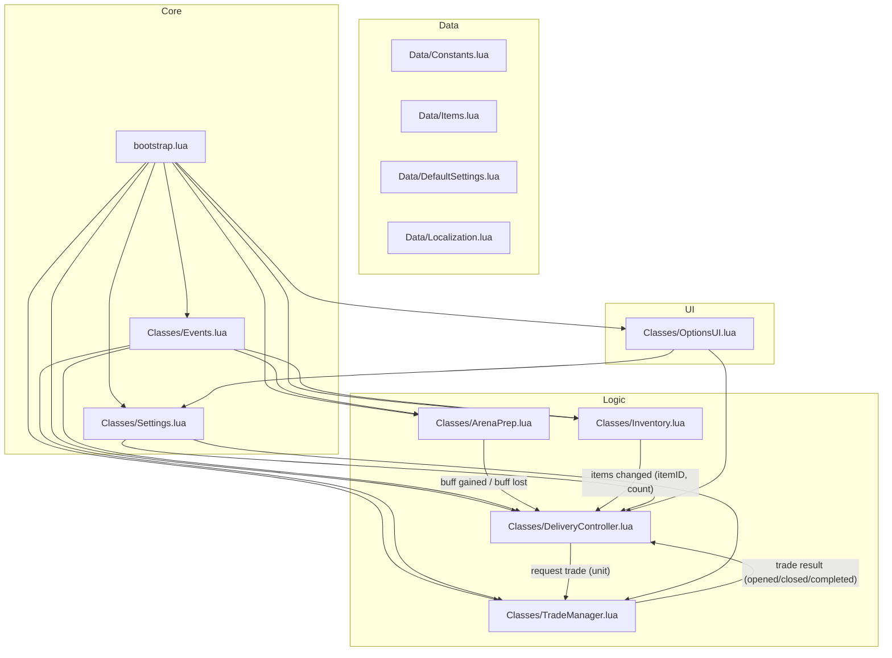
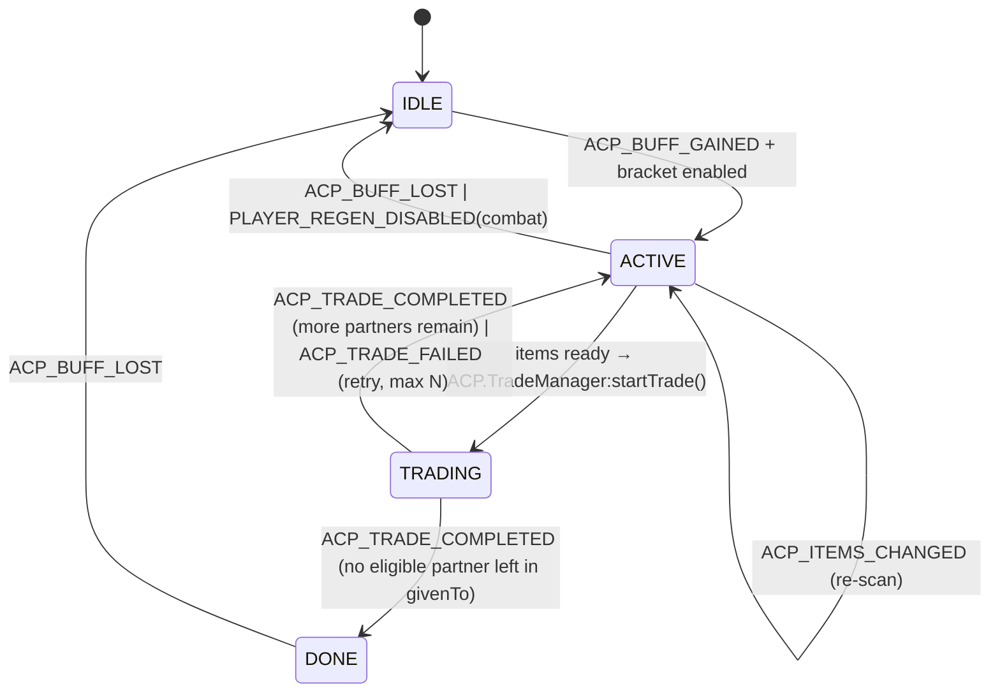

# ArenaChillPrep Architecture

This document describes the architecture of the **ArenaChillPrep** addon (v0.1) — automatic handoff of crafted items to a partner during arena preparation (TBC Anniversary, Interface `20506`).

---

## 1. Principles

1. **Modularity.** Each module is a separate file-table. A module knows nothing about the internals of other modules — only their public API.
2. **One global object.** `ACP` is the addon's only global table. Inside — nested modules: `ACP.Events`, `ACP.ArenaPrep`, `ACP.Inventory`, `ACP.DeliveryController`, `ACP.TradeManager`, `ACP.Settings`, `ACP.Data.*`, `ACP.Utils.*`.
3. **Event-driven.** All inter-module communication goes through events (callback registration in `ACP.Events`). No direct calls, no time-based dependencies.
4. **No libraries.** Vanilla WoW API only. The addon must work without external dependencies (unlike Gargul, which uses Ace — overkill here).
5. **Testability.** Logic (state machine, item catalog, counters) is separated from the game API so unit tests can be written in a sandbox (see `Tests/`).
6. **Gameplay safety.** The addon does nothing destructive: it only opens the trade window and places items. Auto-accept strictly follows the setting, default `false`.

---

## 2. Module overview



### 2.1 `bootstrap.lua` — entry point

- Creates the global `ACP` table.
- Creates an invisible event frame `ACP.Frame` (`CreateFrame("Frame")`).
- Subscribes to `ADDON_LOADED` and initializes modules in strict order:
  1. `ACP.Data.*` (already loaded via TOC)
  2. `ACP.Events:_init(frame)`
  3. `ACP.Settings:_init()` — reads `ArenaChillPrepDB`
  4. `ACP.ArenaPrep:_init()`
  5. `ACP.Inventory:_init()`
  6. `ACP.TradeManager:_init()`
  7. `ACP.DeliveryController:_init()`
  8. `ACP.OptionsUI:_init()`
- Right after initialization it runs an initial state check (`ArenaPrep:checkNow()`), to catch the case where the buff is already active when the addon loads (e.g., after `/reload` in an arena).

### 2.2 `Classes/Events.lua` — event bus

A simplified version of the Gargul pattern:

```lua
ACP.Events:register(identifier, event, callback)
ACP.Events:unregister(identifier, event)
ACP.Events:fire(event, ...)
```

- The frame's `OnEvent` dispatches raw game events to subscribers.
- `fire` is used by modules for internal events (`ACP_BUFF_GAINED`, `ACP_ITEMS_CHANGED`, `ACP_TRADE_*`).
- Lets modules unsubscribe without knowing about other subscribers.

### 2.3 `Classes/ArenaPrep.lua` — arena preparation detection

Answers one question only: **is the preparation buff active right now?** Plus, as a side responsibility: **which arena bracket are we in?**

```lua
ACP.ArenaPrep:isActive() -> boolean
ACP.ArenaPrep:checkNow()  -- forced re-check
ACP.ArenaPrep:getBracket() -> "2v2" | "3v3" | "5v5" | nil
ACP.ArenaPrep:getRemainingTime() -> number | nil  -- seconds until the prep buff expires (gate open)
```

- Looks up the buff by spellID `32727` — **verified on 2.5.5**: `C_UnitAuras.GetPlayerAuraBySpellID(32727)` returns an object. (`UnitBuff("player", name)` crashes — the deprecated wrapper only accepts a numeric index; `UnitAura(unit, i, filter)` returns shifted legacy positions with no spellID/expirationTime — neither is usable here.)
- **Remaining time = gate-open countdown.** Verified on 2.5.5: the prep buff aura reports `duration=0`/`expirationTime=0`, so the aura cannot measure the countdown. The working source (ArenaAnalytics + sArena on the same client) is `CHAT_MSG_BG_SYSTEM_NEUTRAL` + the localized countdown message map (`ACP.Data.Constants.ARENA_COUNTDOWN_MESSAGES`): "One minute..." = 60, "Thirty seconds..." = 30, "Fifteen seconds..." = 15, "The Arena battle has begun!" = 0. `countdownEndTime = GetTime() + N` (seeded `+60 s` on buff gain as a fallback); `getRemainingTime()` = `countdownEndTime - GetTime()`, returns `nil` if unknown (the gate check then does not block).
- **Why not `GetBattlefieldTimeRemaining()`:** it is a battleground match timer, not the pre-gate countdown.
- Listens to `UNIT_AURA` (filter `"player"`) and `PLAYER_ENTERING_WORLD`.
- On state change: `Events:fire("ACP_BUFF_GAINED")` / `Events:fire("ACP_BUFF_LOST")`.
- **Extra safety:** a periodic ticker (1 s) while the buff is active, because `UNIT_AURA` in TBC doesn't always fire when the buff fades — a known quirk.

**Bracket detection** (researched & verified available on 20506):

```lua
-- Primary signal: party size. In TBC you queue with a group of exactly the
-- bracket size; the group is locked once inside the arena, so it's stable.
local partySize = GetNumPartyMembers() + 1;  -- 2, 3 or 5
local bracketBySize = { [2] = "2v2", [3] = "3v3", [5] = "5v5" };
local bracket = bracketBySize[partySize];

-- Cross-check: GetNumArenaOpponents() was added in 2.5.1 (present on 20506).
-- Returns 1/2/4; may be 0 briefly at arena load → party size remains the
-- source of truth, the opponent count is only a sanity check.
if (bracket and GetNumArenaOpponents) then
    local opponents = GetNumArenaOpponents();
    if (opponents and opponents > 0) then
        -- optional: log a mismatch; don't override party size
    end
end
return bracket;  -- nil if not in a recognized bracket
```

Notes:
- **`GetNumPartyMembers` is the TBC-era name.** `GetNumSubgroupMembers` only exists from 5.0.4+; shim both (`GetNumPartyMembers or GetNumSubgroupMembers`).
- Unknown sizes (e.g. `4`) → `nil` → the bracket is treated as not enabled (see 2.5).
- Only call it while `isInArena` (instance type `arena`) — outside an arena the party size has nothing to do with brackets.

### 2.4 `Classes/Inventory.lua` — bag scanner

```lua
ACP.Inventory:getCount(itemID) -> number
ACP.Inventory:findItem(itemID, skipSoulbound) -> bagID, slot, count | nil
```

- `findItem` delegates to `Utils/Items.findItemInBags` — a simplified port of Gargul's `GL:findBagIdAndSlotForItem`; with `skipSoulbound = true` (default) items with no trade time remaining are skipped, so only tradable items are ever placed.

- Full bag scan (bag `0..4`, slots `1..GetContainerNumSlots(bag)`).
- Counts with stacks (`GetContainerItemInfo(bag, slot)` → `stackCount`).
- Listens to `BAG_UPDATE` / `BAG_UPDATE_DELAYED`.
- When the count of any tracked item changes — `Events:fire("ACP_ITEMS_CHANGED", itemID, count)`.
- Cache: after `BAG_UPDATE` only the affected bag is re-counted (optimization); a full scan invalidates everything.
- The set of tracked itemIDs comes from `ACP.Data.Items` + settings (which ranks are enabled).

### 2.5 `Classes/DeliveryController.lua` — orchestrator (core logic)

The only module that makes **decisions**. States:



On `ACP_BUFF_GAINED` the controller first checks the bracket gate:

```
local bracket = ACP.ArenaPrep:getBracket();          -- "2v2" | "3v3" | "5v5" | nil
if (not bracket or not Settings:get("brackets." .. bracket)) then
    -- log: "bracket <bracket or 'unknown'> not enabled, skipping" → stay IDLE
    return;
end
state = ACTIVE
```

`ACTIVE` state logic (on each `ACP_ITEMS_CHANGED` event or ticker):

```
-- Ready = EVERY selected rank has enough items (ranks are grouped by their
-- catalog `rank`; paired IDs like 19012/19013 are ONE rank — Major).
for each enabled category:
    for each selected rank (unique catalog rank among setting.ranks):
        rankCount = sum of Inventory:getCount(itemID) for all selected IDs of that rank
        if rankCount < setting.count: categoryNotReady = true; break
    if categoryNotReady: continue
    ready = true
if ready and partner determined (not in givenTo) and not in combat
        and (ACP.ArenaPrep:getRemainingTime() or math.huge) >= Settings:get("gateSafetySeconds"):
    ACP.TradeManager:startTrade(partnerUnit)  -- places one `count` of EVERY ready rank
```

- **Default = 2 stones:** `ranks = { [19012], [19013], [22105] }` → two unique ranks (Major + Master), each `count` 1 → the addon waits for BOTH a Major and a Master, then trades both (what high-rated players make for their partner and themselves per arena).

- **Partner detection:** always `"auto"` — the first party member that isn't `"player"`, is within trade range (`UnitExists`, `UnitIsUnit`) and is **not in `givenTo`**. Arena teammates are always `party1..partyN` (in TBC you queue as a group of the bracket size), so no manual slot is needed or exposed.
- **Bracket gate:** only `ACTIVE` (and therefore trading) if the current bracket from `ArenaPrep:getBracket()` is enabled in `Settings:get("brackets." .. bracket)` — default **2v2 only**.
- **Per-partner trade protection (`givenTo`):** runtime-only set (per prep, **not** saved to `ArenaChillPrepDB`) of partners who already received items, reset on `ACP_BUFF_LOST`. Partner detection skips `givenTo` members; after `ACP_TRADE_COMPLETED` the partner is added. When no eligible partner remains → `DONE`; otherwise the controller returns to `ACTIVE` to await the next crafted item. (2v2 = one partner → effectively one trade per prep.)
- **Trade-open timeout:** `InitiateTrade` can fail silently (out of range, partner offline/disconnected, player dead) without firing `TRADE_SHOW` *or* `TRADE_CLOSED` — without a timeout the controller would stay `TRADING` forever. So every initiation schedules a one-shot `TradeOpen` timer (`TRADE_OPEN_TIMEOUT = 1.0 s`). `ACP_TRADE_OPENED` (fired by TradeManager on `TRADE_SHOW` for auto-initiated trades) cancels it; if it fires first, the controller calls `TradeManager:cancel()` (resets the stuck low-level state) and routes through `onTradeFailed("timeout")` → retry with backoff.
- **Stray-failure guard:** `ACP_TRADE_FAILED` is only handled while `state == "TRADING"`. A failure verdict arriving after a reset (e.g. the window was closed after the buff faded / gates opened) is ignored — it must not return the controller to `ACTIVE` and risk a trade after the gates open.
- **Gate safety:** a trade is only initiated while `ArenaPrep:getRemainingTime() >= Settings:get("gateSafetySeconds")` (default 15); pending initiations/retries are cancelled once the remaining time drops below the threshold. An already-open trade window is left untouched.
- **Death:** `canStartTrade` refuses while `UnitIsDeadOrGhost("player")` (a dead player cannot initiate a trade); the retry on `PLAYER_REGEN_ENABLED` / the ACTIVE ticker resumes after revival if the buff is still active.
- **Reset:** `ACP_BUFF_LOST` or entering combat → `IDLE` (the combat flag clears on `PLAYER_REGEN_ENABLED`). `onTradeCompleted` also guards on `ArenaPrep:isActive()` — a trade completed after the buff faded (window open across the gates) resets to `IDLE` instead of resuming.

### 2.6 `Classes/TradeManager.lua` — trade automation

A low-level module. Knows only about one trade window. It is a dependency-free port of the patterns proven in Gargul's `Classes/TradeWindow.lua` (same client).

```lua
ACP.TradeManager:startTrade(unit, callback) -- InitiateTrade; callback(success) after TRADE_SHOW or 1 s timeout
ACP.TradeManager:queueItems(itemIDs)        -- FIFO queue of items to place
ACP.TradeManager:cancel()                   -- cancel the current attempt
ACP.TradeManager:isTrading() -> bool
```

- **`cancel()`** resets the low-level trade state (`trading = false`, clears `partnerUnit`, `ItemsToAdd`/`ItemsAdded`, cancels the placement/auto-accept timers, `ClearCursor()`). It is called by the DeliveryController's open-timeout handler: if the window never opened, the low-level `trading` flag would stay stuck `true` and block every later `startTrade` — `cancel()` unwedges it before the retry.

WoW events: `TRADE_SHOW`, `TRADE_CLOSED`, `TRADE_ACCEPT_UPDATE`, `TRADE_TARGET_ITEM_CHANGED`, `ITEM_UNLOCKED`, `UI_INFO_MESSAGE`.

Flow (adapted from Gargul):

```
InitiateTrade(unit)
    └─> one-shot listener on TRADE_SHOW + 1 s timeout (the timeout lives in the
        DeliveryController — it schedules "TradeOpen" = TRADE_OPEN_TIMEOUT and
        fires ACP_TRADE_FAILED("timeout") if ACP_TRADE_OPENED doesn't arrive in time)
         ├─ timeout → TradeManager:cancel() → ACP_TRADE_FAILED("timeout")
         └─ TRADE_SHOW → verify partner
              (UnitName("NPC", true) + TradeFrameRecipientNameText, handles Name-Realm)
              → if this is an auto-initiated trade (self.trading): fire ACP_TRADE_OPENED
                (tells the controller the window is up → it cancels its "TradeOpen" timer)
              → callback(true)
              → process the FIFO queue on a short repeating ticker (one item per tick):
                    find the item in bags, skip soulbound (Inventory:findItem)
                    UseContainerItem(bag, slot)  -- game auto-places it into the next free slot
              → ITEM_UNLOCKED: if the game removed an item added < 0.5 s ago → re-queue it
              → if autoAccept:
                    C_Timer.After(tradeDelay, TradeFrameTradeButton:Click())
              → completion: UI_INFO_MESSAGE == ERR_TRADE_COMPLETE
                    → Events:fire("ACP_TRADE_COMPLETED")
                    → TRADE_CLOSED without completion → Events:fire("ACP_TRADE_FAILED", reason)
```

- **Why `UseContainerItem` instead of `PickupContainerItem` + `ClickTradeButton`:** with the trade window open, `UseContainerItem(bag, slot)` places the item into the next available trade slot automatically — one call instead of two, and it's what Gargul uses on the same client.
- **One item per tick.** Adding items too fast makes the game silently remove them from the trade window. The FIFO queue + repeating ticker prevents this; the `ITEM_UNLOCKED` re-add covers the rare cases where it still happens.
- **Completion detection.** `TRADE_CLOSED` fires before the completion message, so it must not be treated as success. Success is detected via `UI_INFO_MESSAGE` with `ERR_TRADE_COMPLETE` (as Gargul does; verify on TBC Anniversary).
- **Retries:** on `ACP_TRADE_FAILED` — up to 3 attempts with backoff (2 s, 4 s, 8 s), then a silent give-up until the next event.
- **Safety:** never touches gold; only slots `TRADE_PLAYER_ITEM_1..6`.
- **Errors** (`ACP_TRADE_FAILED` with reason): timeout (window didn't open), out of range, in combat, partner declined, window closed before placement, item ran out (another source).
- **Cursor hygiene:** always `ClearCursor()` on `TRADE_CLOSED` in case an item is still on the cursor.
- **Timers:** use `ACP.Utils.Timers` (named wrappers over `C_Timer.After` / `C_Timer.NewTicker` — available on 20506), not Ace.

### 2.7 `Classes/Settings.lua` and `Data/DefaultSettings.lua`

- `ArenaChillPrepDB` — SavedVariables (see `.github/CONTEXT.md`).
- `Settings:get(path)` / `Settings:set(path, value)` — access by dot path (`"items.healthstone.count"`).
- On load — deep merge of defaults and saved data (robust against new settings added in future versions).

### 2.8 `Classes/OptionsUI.lua`

- Panel in **Settings** (AddOns category → **ArenaChillPrep** with a **subcategory "Autotrade"**) — registered via `Settings.RegisterCanvasLayoutCategory` (parent) + `Settings.RegisterCanvasLayoutSubcategory` per subcategory on 2.5.5 (the native Prat/GladiatorlosSA/GatherMate2 look). Legacy `InterfaceOptions_AddCategory` (single panel) is the fallback for other clients.
- Extensible: `self.Subcategories = { { key, title, build }, ... }` — future General/Abilities/Custom/Profiles just append an entry; each subcategory is its own frame.
- **Autotrade** content in a two-column grid (all groups boxed, `BackdropTemplate`):
  - left: **General** box (master switch, `autoAccept` + tooltip), **Arena brackets** box (2v2 active; 3v3/5v5 shown disabled — `Disable()` + alpha, code kept for future releases);
  - right: **Ranks to pass** box (WeakAuras-style boxed list built from the class's categories — Warlock → healthstones), **Timing** box (`tradeDelay`, `gateSafetySeconds` sliders — each slider draws its text label above it so long labels never clip).
- Fixed panel size (660×440), nothing overflows.
- Partner is always auto (first non-self party member) — no manual slot.
- Slash command `/acp` (opens the panel — prefers the Autotrade subcategory — with no args; `status`/`enable`/`disable`/`debug` with args).
- All changes — instantly into `ArenaChillPrepDB` via `Settings:set`.

### 2.9 `Data/Items.lua` — item catalog

```lua
ACP.Data.Items = {
    healthstones = {  -- v0.1: only these (rank 1..6; paired IDs = one rank)
        [19004] = { id = 19004, rank = 1, name = "Minor Healthstone" },
        [19005] = { id = 19005, rank = 1, name = "Minor Healthstone" },
        [19006] = { id = 19006, rank = 2, name = "Lesser Healthstone" },
        [19007] = { id = 19007, rank = 2, name = "Lesser Healthstone" },
        [19008] = { id = 19008, rank = 3, name = "Healthstone" },
        [19009] = { id = 19009, rank = 3, name = "Healthstone" },
        [19010] = { id = 19010, rank = 4, name = "Greater Healthstone" },
        [19011] = { id = 19011, rank = 4, name = "Greater Healthstone" },
        [19012] = { id = 19012, rank = 5, name = "Major Healthstone" },
        [19013] = { id = 19013, rank = 5, name = "Major Healthstone" },
        [22105] = { id = 22105, rank = 6, name = "Master Healthstone" },
    },
    -- future categories (v0.2+): food, water, totems, ...
    classItems = {
        [CLASS_WARLOCK] = { "healthstones" },
        -- [CLASS_MAGE]   = { "food", "water" },
    },
}
```

The `classItems` mapping is what flexibility is built on: the addon knows what the current class can pass and shows only relevant settings.

---

## 3. End-to-end data flow (v0.1)

```mermaid
sequenceDiagram
    participant W as WoW client
    participant AP as ArenaPrep
    participant INV as Inventory
    participant DC as DeliveryController
    participant TM as TradeManager

    W->>AP: UNIT_AURA / ticker: buff 32727 appeared
    AP->>DC: fire("ACP_BUFF_GAINED")
    DC->>AP: getBracket() → "2v2"
    DC->>DC: brackets["2v2"] enabled → state = ACTIVE, determine partner
    DC->>INV: getCount(19009) (Master Healthstone)
    INV-->>DC: 0 (not crafted yet)
    DC->>DC: wait for ACP_ITEMS_CHANGED

    Note over W,INV: Warlock crafts the Healthstone
    W->>INV: BAG_UPDATE
    INV->>INV: recount the bag, count = 1
    INV->>DC: fire("ACP_ITEMS_CHANGED", 19009, 1)

    DC->>DC: 1 >= setting.count (1) → ready
    DC->>TM: startTrade("party1")
    W->>TM: TRADE_SHOW (partner verified)
    TM->>INV: findItem(19009)
    INV-->>TM: bag=0, slot=12
    TM->>W: UseContainerItem(0,12) (auto-placed into slot 1)
    TM->>W: (autoAccept) TradeFrameTradeButton:Click()
    W->>TM: UI_INFO_MESSAGE: ERR_TRADE_COMPLETE
    TM->>DC: fire("ACP_TRADE_COMPLETED")
    DC->>DC: givenTo += partner; no eligible partner left → state = DONE
    W->>AP: buff faded (gate opened)
    AP->>DC: fire("ACP_BUFF_LOST")
    DC->>DC: state = IDLE
```

---

## 4. Edge cases

| Situation | Behavior |
|---|---|
| Buff already active on load (`/reload` in an arena) | `checkNow()` at init |
| Item crafted before preparation started | Trade starts right after `ACP_BUFF_GAINED` (item already in bags) |
| Partner declined the trade request | `ACP_TRADE_FAILED` → retry ×3 with backoff → silent reset to `ACTIVE` |
| Trade window doesn't open within 1 s (`InitiateTrade` silently failed: out of range, partner offline, dead) | Controller's one-shot `TradeOpen` timer fires → `TradeManager:cancel()` (unwedges `trading`) → `ACP_TRADE_FAILED("timeout")` → retry with backoff ×3 → silent give-up |
| Partner disconnect during prep | `InitiateTrade` fails silently → open timeout → retries ×3 → give-up; on reconnect `GROUP_ROSTER_UPDATE` → `checkReady()` resumes (if the buff is still active) |
| Partner disconnect during an open window | Window closes → `TRADE_CLOSED` alone → `ACP_TRADE_FAILED("closed")` → retry with backoff |
| Death before the trade started | `canStartTrade` refuses while `UnitIsDeadOrGhost("player")`; `PLAYER_REGEN_ENABLED` / the ACTIVE ticker resumes after revival (buff still active) |
| Stray failure after reset (window closed after the buff faded / gates opened) | `onTradeFailed` only acts while `state == "TRADING"` → the stray `ACP_TRADE_FAILED` is ignored, controller stays `IDLE` — no trade after the gates open |
| Combat started before the trade finished | `PLAYER_REGEN_DISABLED` → cancel attempts; after combat (if the buff is still active) — retry |
| Game auto-removed an item from the trade window | `ITEM_UNLOCKED` re-add (items added < 0.5 s ago are re-queued) |
| Fewer items than configured | Wait for `ACP_ITEMS_CHANGED`, re-scan |
| Healthstone already passed | State `DONE`, another trade only in the next arena |
| Not an arena (other instance type) | Check `GetInstanceInfo()` type `arena` — the addon is idle |
| Healthstone stacks (up to 10) | The counter sums `stackCount`; when placing, take one at a time (`SplitContainerItem` if needed) |
| Soulbound item in bags (e.g. another rank) | Bag search skips soulbound items (no trade time remaining) |
| Arena bracket not enabled in settings | Bracket gate on `ACP_BUFF_GAINED`: `getBracket()` returns `nil` or the bracket is unchecked → stay `IDLE`, log "bracket X disabled" |
| Bracket detection edge cases | Opponent count `0` briefly at arena load → party size is the source of truth; unknown party size (e.g. `4`) → `nil` → gate treats it as disabled |
| `GetNumArenaOpponents` unavailable | Feature-detect (`if GetNumArenaOpponents then`) — bracket still works via party size only |
| Second item crafted after a successful trade (same prep) | `givenTo` contains the partner → skipped. 2v2 → no eligible partner → `DONE`; 3v3/5v5 → the controller stays `ACTIVE` (as long as an unserved partner exists) and trades the next crafted item with the *other* partner — both when the item was already in bags at completion time and when it is crafted later (`ACP_ITEMS_CHANGED` re-checks) |
| Prep time runs out (`remaining <= gateSafetySeconds`) | No new trades initiated; pending initiations/retries cancelled; an open window is left untouched |
| Remaining time unavailable (`duration`/`expirationTime` missing) | `getRemainingTime()` returns `nil` → gate not enforced (trade allowed), log a debug note |
| `GetSpellInfo(32727)` returned nil (no data) | Fallback to spellID iteration via `UnitBuff` |

---

## 5. Key decisions (ADR style)

1. **No Ace libraries.** The addon is small, vanilla API suffices. Downside: no ready-made Ace event frame — we write our own (minimal).
2. **Orchestrator separate from execution.** `DeliveryController` (what to do) doesn't know how `TradeManager` (how to do) works with the window. This allows unit-testing decision logic without the game.
3. **Buff localization via `GetSpellInfo`.** No hardcoded buff name strings.
4. **Internal events.** All module transitions go through `ACP.Events:fire(...)`, so modules can be attached/detached independently (future: more classes, more items).
5. **Settings use dot paths.** `Settings:get("items.healthstone.count")` — easy to extend and validate.
6. **Port Gargul's trade patterns, not its code.** Gargul (`Classes/TradeWindow.lua`, same client) has proven trade mechanics: `UseContainerItem` placement into the open trade window, FIFO queue + one-item-per-tick, `ITEM_UNLOCKED` re-add, `open()` with callback + 1 s timeout, completion via `ERR_TRADE_COMPLETE`. ArenaChillPrep reimplements these dependency-free (timers via `C_Timer`, not Ace). This is the single most valuable piece of prior art for this addon.
7. **Timers are named and centralized.** `ACP.Utils.Timers:after/interval/cancel` mirrors Gargul's `GL:after/GL:interval` API so call sites read identically, but the implementation is a thin wrapper over `C_Timer`.

---

## 6. Future expansion (not in v0.1)

- **v0.2:** Mage — food/water (`food`/`water` categories, same `Inventory` → `DeliveryController` → `TradeManager` pipeline).
- **v0.3:** multiple partners (trade queue in 3v3/5v5), auto-crafting (cast the spell if enabled), "best available rank" selection instead of a fixed one.
- **v1.0:** profiles, multilingual UI (en/ru), CurseForge/Wago release.

### How to add a new class / item (step by step)

The pipeline (`Inventory` → `DeliveryController` → `TradeManager`) is category-agnostic — it only consumes the catalog (`Data/Items.lua`), the settings (`items.<singular>`) and the localization. Adding a class or item touches **data files only**; no logic changes are needed unless the new category behaves differently (e.g. needs splitting stacks).

**Adding a new item to an existing class** (e.g. another healthstone rank):

1. `Data/Items.lua` — add the record to the category table: `[itemID] = { id = itemID, rank = N, name = "..." }` (paired IDs that are one rank share the same `rank`; the UI shows one checkbox per rank).
2. `Data/DefaultSettings.lua` — add the itemID to `items.<category>.ranks` if it should be passed by default; existing users get it via `Settings:ensureDefaults` migration only for NEW keys — an un-ticked rank is simply not passed (the player can tick it in the UI).
3. `Data/Localization.lua` — if the rank is new, append its name to `L.ranks` (enUS + ruRU), indexed by `rank`.

**Adding a new class** (e.g. Mage → food/water):

1. `Data/Items.lua` — add the new category table(s) (`food = { ... }`, `water = { ... }`) with the same record shape as `healthstones`.
2. `Data/Items.lua` — map the class in `classItems`: `[CLASS_MAGE] = { "food", "water" }` (guard the constant: `local CLASS_MAGE = _G.CLASS_MAGE or "MAGE"` — class globals are NOT defined on TBC Anniversary FrameXML, see `.github/CONTEXT.md`).
3. `Data/DefaultSettings.lua` — add `items.<singular>` blocks (`enabled`, `count`, `ranks`). `Settings:ensureDefaults` fills them for existing users on load.
4. `Data/Localization.lua` — add the category display name to `L.categoryNames` (key = singular) and any new rank names to `L.ranks`.
5. UI — nothing to change: `OptionsUI:buildAutotrade` renders the "Ranks to pass" box from the class's categories (`buildRankRows`); a second category gets its own rows (adjust the box height in `buildAutotrade` if many categories overflow the 660×400 panel).
6. `Inventory` — nothing to change: tracked IDs are rebuilt from `classItems` on login.
7. `DeliveryController` / `TradeManager` — nothing to change: ready-check and placement iterate categories generically (`category:sub(1, -2)` maps plural catalog key → singular settings key).
8. Verify: craft the item during arena prep → the trade opens and places it; `/acp status` shows the new counts.
